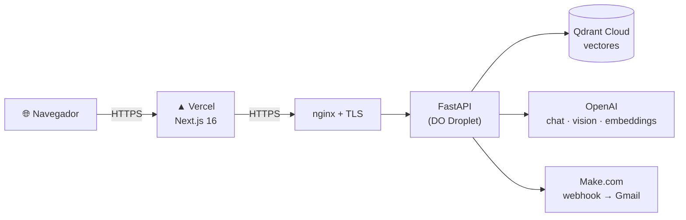
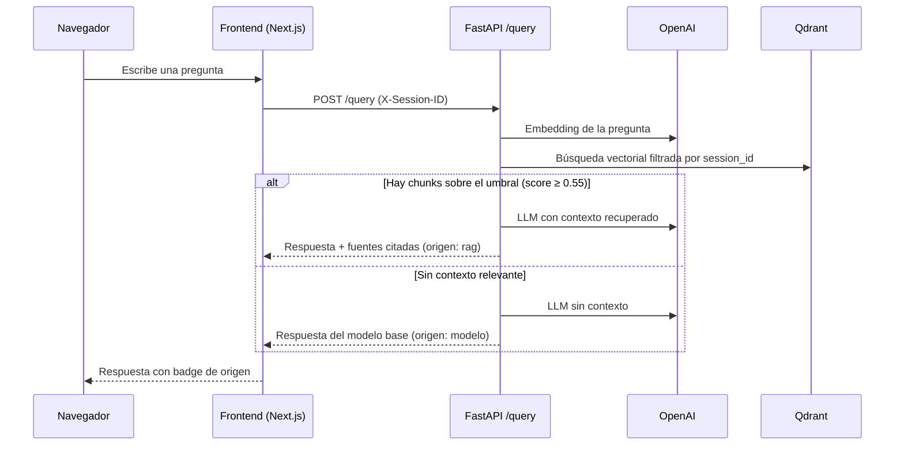
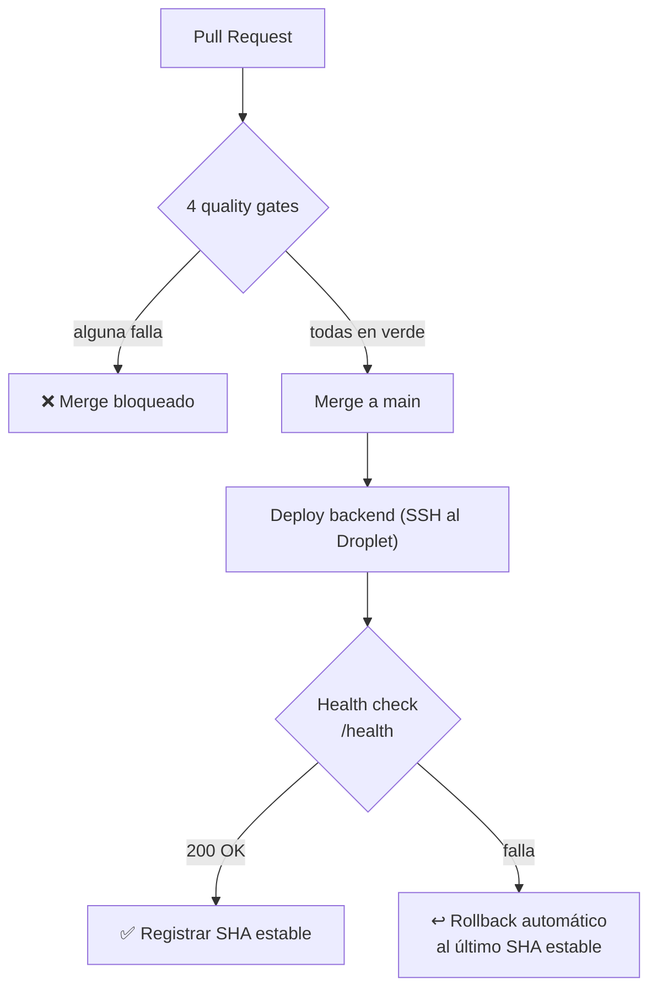

# Mentor IA

Sistema **multiagente de aprendizaje** que combina **RAG** sobre tus propios
documentos, **OCR multimodal** e **IA generativa** para producir planes de
repaso espaciado con notificación por correo.

🌐 **Demo en vivo:** <https://www.iamentor.tech>

> Prototipo académico funcional para un único usuario — no es un producto
> comercial ni un SaaS multitenant. Ver [Contexto](#contexto-académico).

---

## Tabla de contenidos

- [Características](#características)
- [Quickstart](#quickstart)
- [Stack](#stack)
- [Arquitectura](#arquitectura)
- [Flujo de una consulta RAG](#flujo-de-una-consulta-rag)
- [Seguridad y aislamiento](#seguridad-y-aislamiento)
- [Variables de entorno](#variables-de-entorno)
- [Estructura del repositorio](#estructura-del-repositorio)
- [Despliegue](#despliegue)
- [CI/CD](#cicd)
- [Documentación](#documentación)
- [Contexto académico](#contexto-académico)
- [Licencia](#licencia)

---

## Características

- 💬 **Chat con citación de fuentes (RAG)** sobre PDF, TXT, Markdown e imágenes.
- 📄 **OCR multimodal** para PDF escaneados y capturas de imagen.
- 📅 **Planes de repaso espaciado** generados automáticamente (D+1 · D+7 · D+14 · D+30).
- ✉️ **Envío opcional** del plan al correo del usuario.
- 🔒 **Aislamiento por sesión anónima** — los documentos de cada visitante no se mezclan.
- 🛡️ **Rate limiting** configurable en los endpoints que consumen créditos de IA.
- 🟢 **Healthcheck público** con degradación visible cuando un servicio externo cae.

---

## Quickstart

Requisitos: **Docker** + **Docker Compose** (backend) y **Node.js 22+** con
**pnpm 11+** (frontend).

### 1. Backend (FastAPI)

```bash
cd backend
cp .env.example .env          # rellenar las claves (ver Variables de entorno)
docker compose up -d --build
curl http://localhost:8000/health
```

### 2. Frontend (Next.js)

```bash
cd frontend
pnpm install
cp .env.local.example .env.local   # NEXT_PUBLIC_BACKEND_URL=http://localhost:8000
pnpm dev
```

Aplicación disponible en <http://localhost:3000>.

---

## Stack

| Capa              | Tecnología                                                       |
| ----------------- | ---------------------------------------------------------------- |
| Frontend          | Next.js 16 · React 19 · TypeScript 5 · Tailwind CSS 4 · shadcn/ui |
| Backend           | FastAPI · Python 3.11 · `uv` · Docker Compose                    |
| Base vectorial    | Qdrant Cloud · 768 dims · distancia COSINE                       |
| Embeddings        | OpenAI `text-embedding-3-large` (768d con MRL + renormalización) |
| LLM (chat + plan) | OpenAI `gpt-4o-mini`                                             |
| OCR               | OpenAI `gpt-4o-mini` Vision (multimodal)                         |
| Rate limiting     | `slowapi` (por IP + `X-Session-ID`)                              |
| Correo            | Make.com Custom Webhook → Gmail Sender                           |
| Hosting backend   | DigitalOcean Droplet + nginx + Let's Encrypt                     |
| Hosting frontend  | Vercel                                                           |

---

## Arquitectura



El backend organiza la lógica en **tres agentes**:

| Agente               | Responsabilidad                                                        |
| -------------------- | ---------------------------------------------------------------------- |
| **AgenteExtraccion** | Ingesta, OCR si hace falta, *chunking* y embeddings hacia Qdrant.      |
| **AgenteRespuesta**  | Búsqueda semántica filtrada por sesión + síntesis con LLM (RAG).       |
| **AgentePlanRepaso** | Genera 4 sesiones de repaso espaciado y, opcionalmente, las envía por correo. |

---

## Flujo de una consulta RAG



El umbral de similitud coseno (`RAG_SCORE_THRESHOLD = 0.55`) es una
salvaguarda contra la alucinación de fuentes: si ningún *chunk* lo supera, el
sistema responde con el modelo base y lo marca claramente como tal.

---

## Seguridad y aislamiento

El sistema está desplegado en internet público sin autenticación (decisión de
alcance académico — un único usuario, sin cuentas ni login). Para que el
despliegue sea seguro sin contradecir ese alcance, se aplican estas defensas:

- **Aislamiento por `session_id` anónimo.** El navegador genera un UUIDv4 y lo
  envía en el header `X-Session-ID`. Documentos, consultas y planes se filtran
  por ese identificador en Qdrant: los datos de un visitante nunca se mezclan
  con los de otro. No es autenticación ni identifica a una persona.
- **Rate limiting** (`slowapi`) por IP + `X-Session-ID` en los endpoints que
  consumen créditos de OpenAI (`/query`, `/upload-document`, `/plan-repaso`,
  `/ocr-imagen`). Los límites son configurables por variable de entorno.
- **Validación uniforme de archivos** — extensión y tamaño (incluido TXT/MD),
  con saneado del nombre para prevenir *path traversal*.
- **Tope de páginas OCR** por PDF escaneado, para acotar el coste de las
  llamadas multimodales.
- **`max_tokens` acotado** en todas las llamadas a OpenAI.
- **Trazabilidad** — cada petición lleva un `X-Request-ID` (UUIDv4) propagado
  a los logs estructurados.

---

## Variables de entorno

Plantilla completa en [`backend/.env.example`](backend/.env.example).

### Backend — requeridas

```env
OPENAI_API_KEY=sk-...
QDRANT_URL=https://....cloud.qdrant.io
QDRANT_API_KEY=...
QDRANT_COLLECTION=mentor_ia_aprendizaje
MAKE_WEBHOOK_URL=https://hook.eu2.make.com/...
CORS_ORIGINS=["https://www.tu-dominio.com","http://localhost:3000"]
# Opcional: regex para orígenes dinámicos (p. ej. previews de Vercel)
CORS_ORIGIN_REGEX=^https://mentor-ia-v2-[a-z0-9]+-<scope>\.vercel\.app$
```

### Backend — opcionales (con default seguro)

Solo hace falta declararlas para sobreescribir el valor por defecto:

```env
# Rate limiting (formato slowapi "N/minute")
RATE_LIMIT_ENABLED=true
RATE_LIMIT_QUERY=20/minute
RATE_LIMIT_UPLOAD=10/minute
RATE_LIMIT_PLAN=5/minute
RATE_LIMIT_OCR=10/minute

# Tope de páginas enviadas a OpenAI Vision por PDF escaneado
OCR_PDF_MAX_PAGES=20

# Límites de tamaño de archivo subido (bytes): imagen / PDF / TXT-MD
MAX_IMAGE_BYTES=10485760
MAX_PDF_BYTES=26214400
MAX_TEXT_BYTES=5242880

# max_tokens por tipo de llamada OpenAI
OPENAI_MAX_TOKENS_CHAT=800
OPENAI_MAX_TOKENS_OCR=2000
OPENAI_MAX_TOKENS_PLAN=400
```

> `CORS_ORIGINS` debe ir como **JSON array** (corchetes y comillas dobles), no
> CSV: `pydantic-settings` 2.x intenta `json.loads()` antes que los validators.

### Frontend

```env
NEXT_PUBLIC_BACKEND_URL=http://localhost:8000
```

---

## Estructura del repositorio

```
mentor-ia-v2/
├── backend/      Servicio FastAPI (Python 3.11 + uv + Docker)
│   ├── src/
│   │   ├── agentes/    Los tres agentes lógicos
│   │   ├── services/   Clientes a OpenAI, Qdrant y Make
│   │   ├── utils/      Chunking, OCR, saneado de nombres, session_id
│   │   └── app.py      Endpoints FastAPI
│   └── tests/    Suite pytest
├── frontend/     Aplicación Next.js 16 (App Router, Turbopack)
├── docs/         Especificaciones técnicas y documentación de diseño
└── README.md
```

---

## Despliegue

- **Backend:** Docker Compose en un Droplet Ubuntu 24.04, expuesto por nginx
  con TLS automático (Let's Encrypt).
- **Frontend:** Vercel, *Root Directory* `frontend/`, build automático desde `main`.

Ambos despliegues son automáticos: cada push a `main` actualiza producción sin
intervención manual.

---

## CI/CD

El repositorio implementa un pipeline completo en GitHub Actions. La rama
`main` está protegida: ningún cambio entra sin pasar las cuatro puertas de
calidad, y el backend se despliega solo con rollback automático ante fallo.



### Workflows

| Workflow            | Archivo                              | Dispara en                              | Función                                            |
| ------------------- | ------------------------------------ | --------------------------------------- | -------------------------------------------------- |
| **CI**              | `.github/workflows/ci.yml`           | PR y push a `main`                      | Lint, audit, tests, build y scan de imagen         |
| **CodeQL**          | `.github/workflows/codeql.yml`       | PR, push a `main` y cron semanal        | Análisis estático de seguridad (SAST)              |
| **Deploy backend**  | `.github/workflows/deploy-backend.yml` | push a `main` que toque `backend/`     | Despliegue SSH al Droplet con health check y rollback |

### Puertas de calidad

Un PR no puede mergearse hasta que las cuatro pasen en verde:

1. **`Backend (lint + audit + smoke)`** — `ruff` (lint + formato), `pip-audit`
   (CVEs en dependencias de runtime), suite `pytest` y un *smoke import* que
   verifica que la app FastAPI carga sin errores.
2. **`Backend (docker build + Trivy scan)`** — construye la imagen Docker y la
   escanea con **Trivy**; falla ante cualquier CVE `HIGH`/`CRITICAL` con parche
   disponible. Los hallazgos se publican en la pestaña *Security* (SARIF).
3. **`Frontend (lint + typecheck + audit)`** — `eslint`, `tsc --noEmit` y
   `pnpm audit`.
4. **`Analyze (python)` / `Analyze (javascript-typescript)`** — CodeQL con el
   preset `security-extended`.

`pip-audit` y Trivy son complementarios: el primero audita las dependencias
Python; el segundo escanea la imagen completa, incluido el SO del base image.

### Despliegue del backend con rollback

1. Conexión por SSH al Droplet con una clave dedicada (validada con
   `ssh-keygen -y` antes de usarla).
2. Sincroniza el código (`git reset --hard` al commit integrado) y reconstruye
   el contenedor (`docker compose up -d --build`).
3. Ejecuta un **health check** contra `/health` (12 intentos × 5 s).
4. Si responde `200`, registra el commit como *último estable* en el Droplet.
5. Si **no** responde, ejecuta un **rollback automático** al último commit
   estable, reconstruye y vuelve a verificar. El workflow se marca en rojo para
   dejar constancia en el historial.

### Decisiones de seguridad del pipeline

- **Actions ancladas por SHA**, no por tag móvil.
- **Sin `pull_request_target`** — el código de un PR nunca se ejecuta con
  acceso a los secretos del repositorio.
- **`GITHUB_TOKEN` con permisos mínimos** (`contents: read`, y
  `security-events: write` solo donde se suben informes SARIF).
- **Clave SSH de despliegue dedicada**, sin passphrase, eliminada del runner al
  terminar cada ejecución (`shred`).

---

## Documentación

- [`docs/specs/`](docs/specs/) — Especificaciones técnicas, plan de
  implementación, política de seguridad de dependencias.
- [`docs/academic/`](docs/academic/) — Documento técnico, modelo de datos,
  arquitectura multiagente, wireframes.

---

## Contexto académico

Trabajo final de la asignatura *Administración de Proyectos de Software* —
Tecnología en Desarrollo de Software, Universidad Tecnológica de Pereira (UTP).

---

## Licencia

Uso académico — UTP.
