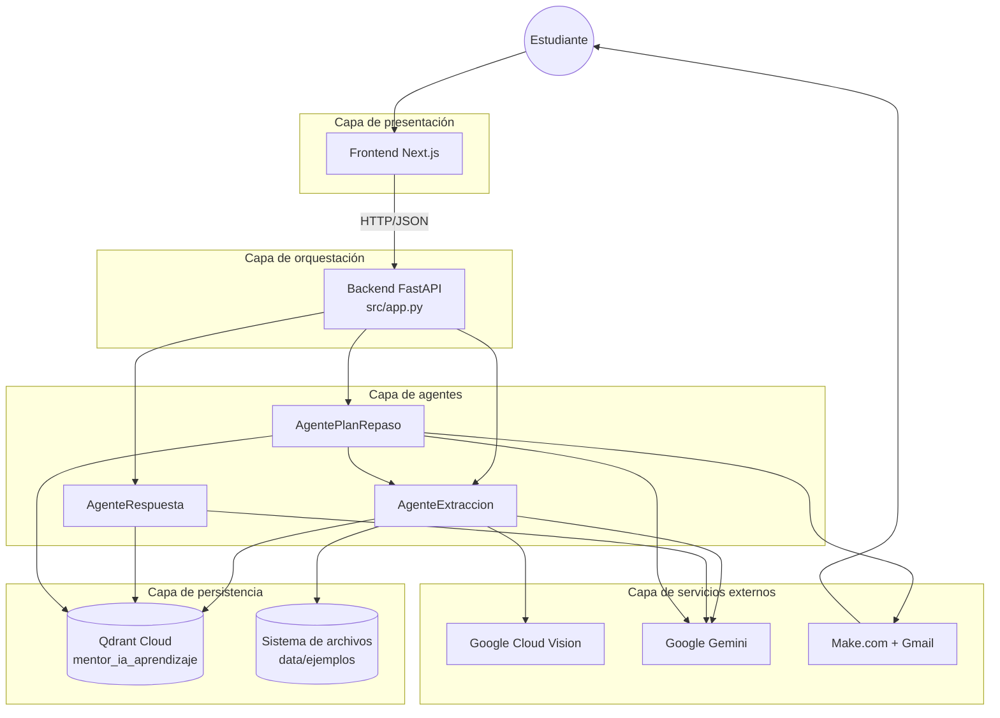
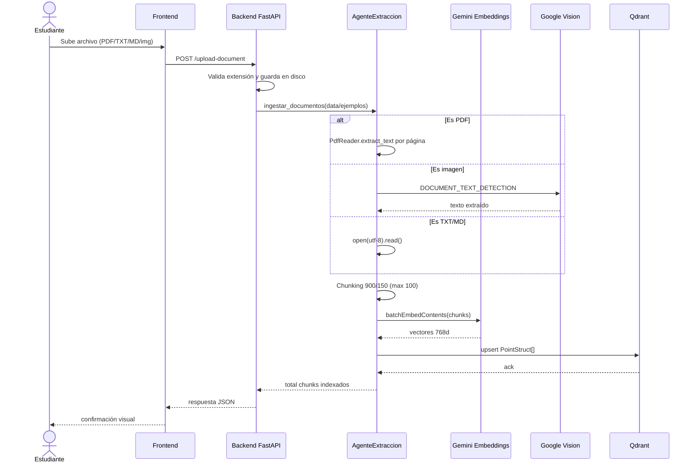
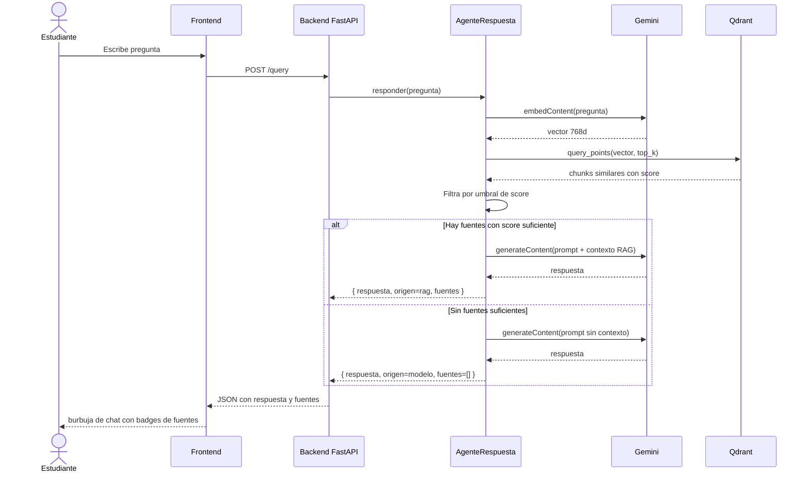
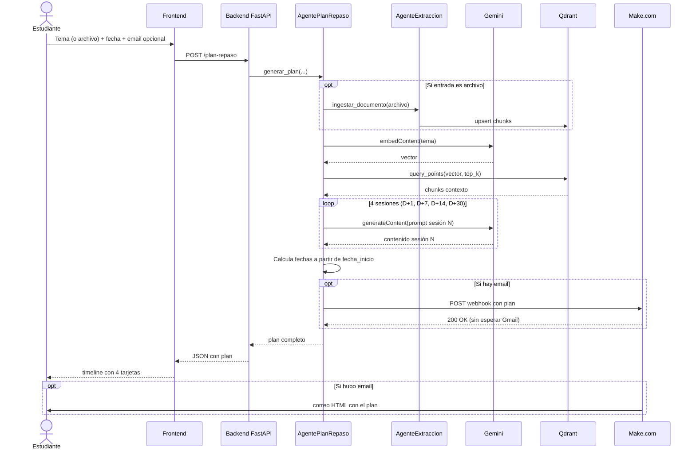

# Arquitectura Multiagente — Mentor IA

> Documento de diseño que describe la arquitectura multiagente del sistema
> **Mentor IA**: cómo se organizan los tres agentes especializados, cuáles
> son sus responsabilidades, cómo se coordinan a través del backend y qué
> limitaciones tiene el diseño actual.
>
> Versión: 1.0 · Fecha: 2026-05-11.
> Tarea ClickUp: Diseño de la arquitectura multiagente.

---

## Tabla de contenidos

1. [Contexto y propósito](#1-contexto-y-propósito)
2. [¿Por qué multiagente?](#2-por-qué-multiagente)
3. [Inventario de agentes](#3-inventario-de-agentes)
4. [Responsabilidades por agente](#4-responsabilidades-por-agente)
5. [Diagrama de comunicación](#5-diagrama-de-comunicación)
6. [Flujos de coordinación](#6-flujos-de-coordinación)
7. [Patrón de orquestación](#7-patrón-de-orquestación)
8. [Limitaciones del diseño actual](#8-limitaciones-del-diseño-actual)
9. [Para defender en sustentación](#9-para-defender-en-sustentación)

---

## 1. Contexto y propósito

Mentor IA opera mediante tres comportamientos especializados que el sistema
ofrece al estudiante:

1. **Indexar conocimiento** (procesar documentos para que sean
   consultables).
2. **Responder preguntas** sobre ese conocimiento usando RAG.
3. **Planificar repasos** distribuidos en el tiempo.

Estos tres comportamientos podrían vivir como funciones sueltas dentro de
un único módulo, pero el proyecto los implementa como **tres agentes
independientes** con responsabilidades aisladas. Este documento explica
ese diseño.

---

## 2. ¿Por qué multiagente?

La decisión de separar la lógica en agentes responde a tres criterios de
ingeniería, no a una preferencia estética.

### 2.1 Responsabilidad única (Single Responsibility)

Cada agente atiende un solo tipo de tarea. La clase `AgenteExtraccion` no
sabe responder preguntas; la clase `AgenteRespuesta` no sabe generar
planes. Esto reduce el acoplamiento: un cambio en cómo se generan los
planes no obliga a tocar el código de ingesta.

### 2.2 Testabilidad aislada

Cada agente se puede probar de forma independiente con mocks de Qdrant,
Gemini o Vision. Si los tres comportamientos vivieran en una sola clase
gigante, cada test requeriría montar todo el stack de dependencias.

### 2.3 Evolución incremental

Si en el futuro se añadiera un cuarto comportamiento (por ejemplo,
evaluación automática del estudiante o generación de preguntas tipo
flashcard a partir del material), bastaría con sumar un nuevo agente sin
modificar los existentes. Es el principio de extensibilidad.

### 2.4 Alternativas que se descartaron

Se evaluaron dos alternativas:

- **Funciones sueltas en un único módulo.** Más simple para empezar, pero
  con riesgo de "función dios" que crece sin control conforme se añaden
  capacidades. Se descartó porque el proyecto está pensado para evolucionar.
- **Microservicios independientes (un agente = un contenedor).** Más
  escalable, pero overkill para un prototipo académico con un solo
  desarrollador. Se descartó por costo de operación injustificado en este
  alcance.

La opción elegida (clases Python independientes orquestadas por el
backend) ofrece la separación lógica deseada sin la complejidad
operacional de los microservicios.

---

## 3. Inventario de agentes

El sistema implementa tres agentes, todos en
`mentor-ia-aprendizaje/src/agentes/`:

| Agente              | Archivo                       | Propósito                                        |
| ------------------- | ----------------------------- | ------------------------------------------------ |
| `AgenteExtraccion`  | `agente_extraccion.py`        | Procesar documentos y poblar la base vectorial    |
| `AgenteRespuesta`   | `agente_respuesta.py`         | Responder preguntas usando RAG sobre Qdrant       |
| `AgentePlanRepaso`  | `agente_plan_repaso.py`       | Generar planes de repaso espaciado                |

No existe un cuarto agente "coordinador". La coordinación entre agentes
la realiza el backend FastAPI desde los endpoints.

---

## 4. Responsabilidades por agente

### 4.1 `AgenteExtraccion`

**Propósito:** Convertir documentos crudos (PDF, TXT, MD, imágenes) en
vectores indexados en Qdrant, listos para búsqueda semántica.

**Entradas:** un directorio de documentos (`data/ejemplos/` por
convención) o un documento individual recién subido.

**Salidas:** chunks de texto vectorizados en la colección
`mentor_ia_aprendizaje` de Qdrant, con su payload asociado.

**Subtareas internas:**

1. **Lectura de fuentes.** Recorre el directorio y clasifica cada archivo
   por extensión (`.pdf`, `.txt`, `.md`, `.png`, `.jpg`, `.jpeg`).
2. **Extracción de texto.**
   - PDF: usa `pypdf.PdfReader` y concatena `page.extract_text()` de cada
     página.
   - TXT/MD: lee con `open(path, encoding="utf-8").read()`.
   - Imágenes: llama a Google Cloud Vision con
     `DOCUMENT_TEXT_DETECTION` y obtiene `fullTextAnnotation.text`.
3. **Chunking.** Trocea el texto en bloques de 900 caracteres con 150 de
   solape, hasta un máximo de 100 chunks por documento (ver
   [`Modelo_Datos_Qdrant.md`](./Modelo_Datos_Qdrant.md) para la
   justificación).
4. **Generación de embeddings.** Llama a la API de Gemini
   (`gemini-embedding-001` con `outputDimensionality=768`) por lotes y
   renormaliza cada vector resultante a norma 1.
5. **Upsert en Qdrant.** Crea los `PointStruct` con `id`, `vector` y
   `payload`, y los inserta en la colección.

**Dependencias externas:** Google Cloud Vision, Google Gemini Embeddings,
Qdrant.

### 4.2 `AgenteRespuesta`

**Propósito:** Recibir una pregunta del estudiante y devolver una
respuesta contextualizada, con referencias a los chunks que la respaldan.

**Entradas:** la pregunta en texto natural.

**Salidas:** un objeto con la respuesta generada, el origen (`rag` si se
encontraron fuentes, `modelo` si no), una lista de fuentes con
`archivo`, `chunk_index` y `score`, y opcionalmente un detalle del
origen.

**Subtareas internas:**

1. **Embedding de la pregunta.** Llama a `gemini-embedding-001` con
   `outputDimensionality=768` para obtener el vector de la consulta,
   renormalizado a norma 1.
2. **Búsqueda semántica.** Llama a `Qdrant.query_points` con el vector
   de la pregunta y obtiene los `top_k` chunks más similares.
3. **Filtrado por score.** Solo considera fuentes que superen un umbral
   mínimo de similitud (configurable). Si ningún chunk supera el umbral,
   `origen = "modelo"` y la respuesta se genera sin RAG.
4. **Construcción del prompt.** Concatena la pregunta con los chunks
   recuperados como contexto.
5. **Generación de respuesta.** Llama a Gemini (`gemini-flash-latest`)
   con el prompt construido.
6. **Normalización.** Convierte la respuesta a string (a veces Gemini
   devuelve listas de partes) y arma el objeto final con fuentes y
   metadatos.

**Dependencias externas:** Google Gemini Embeddings, Google Gemini LLM,
Qdrant.

### 4.3 `AgentePlanRepaso`

**Propósito:** Generar un plan de repaso espaciado para un tema dado, en
cuatro sesiones (D+1, D+7, D+14, D+30), y enviar el plan por correo
electrónico si el estudiante proporcionó un email.

**Entradas:** un tema (string), una fecha de inicio y un email opcional.
Alternativamente, un archivo (PDF/TXT/MD) que se indexa antes de generar
el plan.

**Salidas:** una lista de cuatro sesiones, cada una con su fecha, tipo
(`D+1`, `D+7`, `D+14`, `D+30`), título y descripción detallada. Si hay
email, además se dispara el envío vía Make.com.

**Subtareas internas:**

1. **(Opcional) Indexar archivo.** Si la entrada es un archivo en lugar
   de un tema, primero invoca a `AgenteExtraccion` para indexar el
   documento.
2. **Búsqueda de contexto.** Para cada una de las cuatro sesiones, busca
   en Qdrant los chunks relevantes al tema. Esto permite que el plan
   esté anclado al material real del estudiante.
3. **Generación de cada sesión.** Hace cuatro llamadas a Gemini, una por
   sesión, con prompts diferenciados (la sesión D+1 enfatiza repaso
   inicial; la D+30 enfatiza consolidación final).
4. **Cálculo de fechas.** A partir de `fecha_inicio`, suma 1, 7, 14 y 30
   días para construir el cronograma.
5. **Envío por email.** Si hay email, hace un `POST` al webhook de
   Make.com con el payload completo del plan. Make.com itera las
   sesiones, las formatea como HTML y las envía con Gmail Sender.

**Dependencias externas:** Google Gemini Embeddings, Google Gemini LLM,
Qdrant, Make.com.

---

## 5. Diagrama de comunicación

**Observaciones del diagrama:**

- Los agentes **no se comunican entre sí horizontalmente**. La única
  excepción es que `AgentePlanRepaso` puede invocar a `AgenteExtraccion`
  cuando el estudiante sube un archivo para generar el plan; esto es una
  llamada Python directa, no un canal de mensajes.
- Toda la coordinación entra y sale a través del **backend FastAPI**.
- Los agentes consumen **servicios externos directamente** (no a través
  del backend), porque eso evita una capa innecesaria de proxy.

---

## 6. Flujos de coordinación

### 6.1 Flujo: subir documento e indexarlo

### 6.2 Flujo: consultar (RAG)

### 6.3 Flujo: generar plan de repaso

---

## 7. Patrón de orquestación

El sistema sigue un patrón de **orquestación centralizada en el backend**,
no de **coreografía entre agentes**.

| Aspecto                       | Patrón usado                                    |
| ----------------------------- | ----------------------------------------------- |
| Quién decide qué agente actúa | El endpoint FastAPI que recibe la petición      |
| Comunicación entre agentes    | Casi nula; el backend los invoca uno a uno      |
| Estado compartido             | Solo a través de Qdrant (memoria a largo plazo) |
| Manejo de errores             | Excepciones Python; el backend las captura      |

Por qué se eligió este patrón en lugar de un sistema de mensajería (RabbitMQ,
Redis Streams, Celery):

- **Simplicidad operacional.** Un solo proceso Python, sin broker externo.
- **Latencia baja.** Llamadas directas en memoria, sin cola intermedia.
- **Trazabilidad fácil.** El stack trace de una petición fallida muestra
  todo el camino desde el endpoint hasta el servicio externo.

El costo de este patrón es que no es escalable a múltiples instancias del
backend con balanceador de carga. En ese escenario, dos peticiones
concurrentes que toquen la misma colección Qdrant podrían producir
condiciones de carrera al re-indexar el mismo documento (porque los
`point_id` actuales no son idempotentes; ver
[`Modelo_Datos_Qdrant.md`](./Modelo_Datos_Qdrant.md)).

Para el alcance académico de instancia única, este compromiso es
aceptable.

---

## 8. Limitaciones del diseño actual

Limitaciones reconocidas, ordenadas por relevancia:

1. **Los agentes no son persistentes.** Cada llamada a un endpoint
   instancia un agente nuevo. No hay caché de estado entre peticiones
   (por ejemplo, no se memoriza qué preguntas hizo el estudiante en su
   sesión). Esto es intencional para mantener stateless el backend, pero
   limita personalización futura.
2. **Acoplamiento implícito entre `AgentePlanRepaso` y `AgenteExtraccion`.**
   Cuando el estudiante sube un archivo para generar plan, el primer
   agente invoca al segundo directamente. Si los agentes vivieran en
   procesos separados (microservicios), este acoplamiento habría que
   formalizarlo como llamada HTTP. Hoy es una llamada Python.
3. **No hay cola de tareas.** Una subida grande bloquea la respuesta. En
   un entorno con muchos usuarios concurrentes esto degradaría la
   experiencia. La solución sería introducir una cola (Celery + Redis),
   pero está fuera del alcance académico.
4. **No hay reintentos automáticos.** Si Gemini falla en la sesión D+14
   del plan, el endpoint devuelve 500 y se pierden las tres sesiones
   anteriores ya generadas. Falta un patrón de fallback o retry.
5. **El sistema asume un único usuario.** No hay aislamiento entre
   "sesiones" de uso. Si dos personas usan el mismo despliegue al
   tiempo, comparten todo el contenido indexado en Qdrant.

Estas limitaciones se documentan honestamente en lugar de ocultarse,
porque reconocerlas demuestra criterio de ingeniería.

---

## 9. Para defender en sustentación

Cuatro puntos clave que deben quedar claros al exponer este documento:

1. **El sistema es multiagente porque tres agentes con responsabilidades
   aisladas resultan más mantenibles, testeables y extensibles que una
   sola función gigante.** No es una moda; es la aplicación del
   principio de responsabilidad única. Si la pregunta es "¿por qué no
   hacerlo todo en una sola función?", la respuesta es: "porque añadir
   un cuarto comportamiento implicaría modificar código existente, en
   lugar de simplemente sumar un cuarto agente".

2. **La coordinación entre agentes es centralizada en el backend, no
   distribuida.** No hay mensajería entre agentes. Esto se eligió por
   simplicidad operacional y trazabilidad. El costo es que el sistema
   no escala horizontalmente sin más cambios, pero ese costo es
   aceptable para un prototipo académico de un único usuario.

3. **`AgentePlanRepaso` puede invocar a `AgenteExtraccion` cuando el
   estudiante sube un archivo para generar un plan.** Esto está
   documentado como una excepción al principio de "los agentes no se
   comunican entre sí". Es una llamada Python directa, no una llamada
   por red.

4. **Las limitaciones del diseño están documentadas en la sección 8.**
   No tener cola de tareas, no tener reintentos automáticos y no tener
   estado persistente entre llamadas son decisiones de alcance, no
   omisiones. La crítica más válida a este diseño sería: "los agentes no
   son persistentes, así que el sistema no recuerda al usuario". La
   respuesta correcta es que la personalización por usuario está fuera
   del alcance académico actual (no hay autenticación) y se documenta
   como mejora futura.

---

_Última actualización: 2026-05-11._
