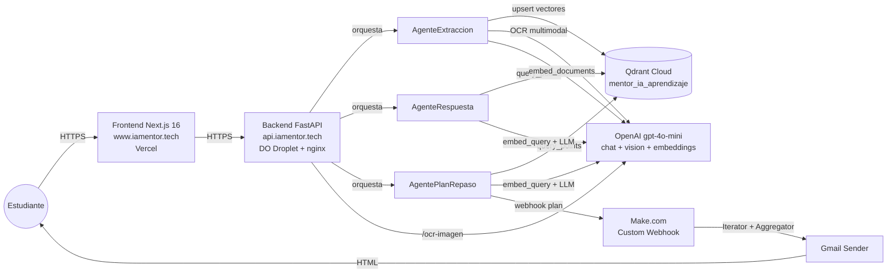

# Documento Técnico — Mentor IA

> Documento técnico del sistema **Mentor IA**, prototipo multiagente con RAG
> para apoyar el estudio mediante consultas sobre documentos propios,
> extracción de texto desde imágenes y generación de planes de repaso
> espaciado.
>
> Asignatura: Administración de Proyectos de Software · Entrega final.
> Versión: 3.0 · Fecha: 2026-05-17.
>
> **Demo en vivo:** Frontend en <https://www.iamentor.tech> · Backend en
> <https://api.iamentor.tech>.

---

## Tabla de contenidos

1. [Introducción](#1-introducción)
2. [Problema a resolver](#2-problema-a-resolver)
3. [Alcance del proyecto](#3-alcance-del-proyecto)
4. [Arquitectura general del sistema](#4-arquitectura-general-del-sistema)
5. [Stack tecnológico](#5-stack-tecnológico)
6. [Justificación de decisiones técnicas](#6-justificación-de-decisiones-técnicas)
7. [Limitaciones conocidas](#7-limitaciones-conocidas)
8. [Estado funcional actual](#8-estado-funcional-actual)
9. [Documentos complementarios](#9-documentos-complementarios)
10. [Trabajo futuro](#10-trabajo-futuro)
11. [Para defender en sustentación](#11-para-defender-en-sustentación)

---

## 1. Introducción

### 1.1 Contexto

Este documento describe el diseño técnico del sistema **Mentor IA**, un
prototipo académico funcional desarrollado como proyecto de la asignatura
*Administración de Proyectos de Software* de la Universidad Tecnológica de
Pereira.

El sistema combina tres tecnologías que se complementan para apoyar el
estudio individual:

- **Generación aumentada por recuperación (RAG)** sobre documentos propios
  del estudiante para responder preguntas con respaldo bibliográfico.
- **Reconocimiento óptico de caracteres (OCR)** para extraer texto desde
  imágenes y apuntes manuscritos.
- **Repaso espaciado** para generar planes de estudio distribuidos en el
  tiempo (D+1, D+7, D+14, D+30) y entregarlos por correo electrónico.

Estas tres capacidades se orquestan mediante una arquitectura multiagente
en la que cada agente tiene una responsabilidad específica. El detalle del
diseño multiagente se desarrolla en
[`Arquitectura_Multiagente.md`](./Arquitectura_Multiagente.md).

### 1.2 Objetivo del sistema

Proveer al estudiante un asistente de estudio que le permita:

- Consultar sus propios materiales (PDF, TXT, MD, imágenes) con respuestas
  contextualizadas y referencias a la fuente.
- Convertir apuntes escaneados o imágenes de pizarra a texto editable.
- Recibir un plan de repaso espaciado por correo, basado en un tema o
  archivo de su elección.

### 1.3 A quién va dirigido este documento

Este documento es la entrada principal a la documentación técnica del
proyecto. Da una visión global del sistema y enlaza con los documentos
específicos de arquitectura multiagente, modelo de datos vectorial, flujos
de interacción usuario-sistema y diseño del frontend.

---

## 2. Problema a resolver

### 2.1 Desafíos identificados en el aprendizaje individual

El proyecto parte del reconocimiento de cuatro dificultades comunes en el
estudio autónomo a nivel universitario:

1. **Sobrecarga de información.** El estudiante acumula PDF de clase,
   apuntes propios y material complementario. Encontrar un dato específico
   entre decenas de documentos requiere tiempo y, con frecuencia, el dato
   se sabe que existe pero no se recuerda dónde.
2. **Falta de personalización en los recursos.** Los buscadores genéricos
   (Google, ChatGPT) responden con información global, no con el contenido
   de los materiales propios del curso.
3. **Procesamiento manual de apuntes físicos.** El estudiante toma apuntes
   en papel o fotografía pizarras y luego no puede buscar en esos materiales
   porque no son texto digital.
4. **Olvido por falta de repaso estructurado.** Tras estudiar un tema, sin
   un plan de repaso espaciado el material se olvida en pocas semanas
   ([curva del olvido de Ebbinghaus](https://en.wikipedia.org/wiki/Forgetting_curve)).

### 2.2 Propuesta de solución

Mentor IA aborda los cuatro problemas con tres funcionalidades
complementarias:

| Problema                            | Funcionalidad del sistema                          |
| ----------------------------------- | -------------------------------------------------- |
| Sobrecarga de información           | Búsqueda semántica + RAG sobre documentos propios  |
| Falta de personalización            | El estudiante sube sus propios materiales          |
| Procesamiento de apuntes físicos    | OCR multimodal con OpenAI `gpt-4o-mini` Vision     |
| Olvido por falta de repaso          | Generación de planes D+1/D+7/D+14/D+30 + email     |

---

## 3. Alcance del proyecto

### 3.1 Qué es este proyecto

Un **prototipo académico funcional** con frontend desplegado en Vercel y
backend desplegable bajo demanda. El sistema es plenamente operativo en un
contexto de uso individual.

### 3.2 Qué NO es este proyecto

Para evitar interpretaciones que excedan el alcance académico, se establecen
explícitamente los siguientes casos fuera de alcance:

- **No es un producto comercial.** No hay planes de monetización, pricing,
  ni estrategia de ventas.
- **No es un SaaS multitenant.** Está diseñado como instancia individual
  para un único usuario por despliegue.
- **No tiene sistema de autenticación.** No hay cuentas de usuario, login,
  ni control de acceso.
- **No es un sustituto del docente o del aula.** Es un asistente de apoyo
  al estudio individual.
- **No está pensado para integrarse con LMS** (Moodle, Canvas) en este
  alcance académico.

### 3.3 Frontera funcional

El sistema acepta archivos en cuatro formatos (PDF, TXT, MD y los formatos
de imagen PNG/JPG/JPEG) y produce tres tipos de salida: respuestas
contextualizadas en chat, texto extraído desde imágenes y planes de repaso
entregados por correo electrónico. Fuera de esa frontera el sistema no
opera.

---

## 4. Arquitectura general del sistema

El sistema sigue una arquitectura por capas con separación clara entre
frontend, backend, agentes especializados, base vectorial y servicios
externos.

### 4.1 Capas del sistema

- **Capa de presentación (Frontend).** Aplicación Next.js desplegada en
  Vercel. Renderiza las pantallas y consume la API REST del backend.
- **Capa de orquestación (Backend).** API FastAPI que expone endpoints
  REST, valida entradas, gestiona el sistema de archivos local para
  documentos cargados y delega la lógica de negocio a los agentes.
- **Capa de agentes.** Tres clases Python especializadas, cada una con su
  responsabilidad. La orquestación entre ellos la realiza el backend; no
  se comunican entre sí directamente.
- **Capa de persistencia.** Qdrant Cloud almacena los vectores
  (embeddings) y sus payloads asociados. El sistema de archivos local del
  backend almacena los documentos originales en `data/ejemplos/`.
- **Capa de servicios externos.** OpenAI `gpt-4o-mini` (chat
  completions, vision multimodal y `text-embedding-3-large` para
  embeddings de 768 dimensiones con MRL), Make.com como pasarela de
  email. La elección de OpenAI 100% se justifica en §6.3 tras
  migraciones documentadas en §6.7.

### 4.2 Patrón de comunicación

Toda la comunicación entre frontend y backend ocurre por HTTPS con cuerpos
JSON. Para subidas de archivos se usa `multipart/form-data` con headers
auxiliares (`X-Filename`). El backend devuelve respuestas JSON
estructuradas con códigos HTTP estándar.

La descripción detallada de cada interacción (qué endpoint hace qué, qué
agentes invoca, qué servicios externos consume) está en
[`Flujo_Interaccion_Usuario_Sistema.md`](./Flujo_Interaccion_Usuario_Sistema.md).

---

## 5. Stack tecnológico

### 5.1 Frontend

| Componente              | Versión / Detalle                                      |
| ----------------------- | ------------------------------------------------------ |
| Framework               | Next.js 16.2.6 con App Router (Turbopack)              |
| Lenguaje                | TypeScript 5 (`strict: true`)                          |
| Runtime UI              | React 19.2.4                                           |
| Estilos                 | Tailwind CSS 4 (vía `@tailwindcss/postcss`)            |
| Sistema de componentes  | shadcn/ui sobre Radix Primitives                       |
| Íconos                  | lucide-react                                           |
| Utilidades de clase     | `class-variance-authority`, `clsx`, `tailwind-merge`   |
| Gestor de paquetes      | pnpm 11+ con `minimumReleaseAge: 1440` (cooldown 24 h supply-chain) |
| Despliegue              | Vercel · <https://www.iamentor.tech>                   |

### 5.2 Backend

| Componente              | Versión / Detalle                                      |
| ----------------------- | ------------------------------------------------------ |
| Framework web           | FastAPI (Python 3.11+)                                 |
| Servidor ASGI           | Uvicorn                                                |
| Gestor de paquetes      | `uv` 0.11+ con `exclude-newer = "7 days"` (cooldown supply-chain) |
| Empaquetado             | Docker Compose (imagen `python:3.11-slim`, usuario no-root) |
| Procesamiento PDF       | `pypdf` 6.x + `pypdfium2` (para render de PDF escaneado a PNG previo a OCR) |
| Cliente Qdrant          | `qdrant-client` (modo async)                           |
| Cliente OpenAI          | `openai` 1.x (modo `AsyncOpenAI`)                      |
| Validación              | Pydantic 2.x + `pydantic-settings` para variables de entorno |
| Cliente HTTP            | `httpx` para llamadas a Make.com                       |
| Logging                 | `loguru` con formato estructurado y toggle `JSON_LOGS` |

### 5.3 Base vectorial

| Aspecto                 | Valor                                                  |
| ----------------------- | ------------------------------------------------------ |
| Servicio                | Qdrant Cloud (tier gratuito 1 GB)                      |
| Colección               | `mentor_ia_aprendizaje`                                |
| Dimensión del vector    | 768                                                    |
| Distancia               | COSINE                                                 |
| Modelo de embeddings    | OpenAI `text-embedding-3-large` con `dimensions=768` (MRL nativo + renormalización a norma unitaria) |

El detalle del modelo de datos vectorial está en
[`Modelo_Datos_Qdrant.md`](./Modelo_Datos_Qdrant.md).

### 5.4 Servicios de IA externos

Todo el stack de IA queda concentrado en un único proveedor para
simplificar credenciales, cuotas y observabilidad. La justificación
de esta consolidación está en §6.3 (decisión final) y §6.7
(cronología de migraciones).

| Servicio                          | Uso                                              |
| --------------------------------- | ------------------------------------------------ |
| OpenAI `gpt-4o-mini` (chat completions) | Generación de respuestas RAG y planes de repaso |
| OpenAI `gpt-4o-mini` (vision multimodal) | OCR de imágenes (PNG/JPG) y páginas PDF escaneadas |
| OpenAI `text-embedding-3-large`   | Embeddings de 768 dimensiones con MRL nativo     |

### 5.5 Automatización

| Servicio                          | Uso                                              |
| --------------------------------- | ------------------------------------------------ |
| Make.com (Custom Webhook)         | Recibir el plan de repaso generado por el sistema |
| Make.com (Iterator + Aggregator)  | Formatear cada sesión del plan                   |
| Gmail Sender (módulo de Make.com) | Enviar el correo HTML al estudiante              |

### 5.6 Infraestructura y despliegue

| Capa                 | Plataforma / detalle                                  |
| -------------------- | ----------------------------------------------------- |
| Frontend             | Vercel (build automático desde rama `main`, root `frontend/`) |
| Backend              | DigitalOcean Droplet Ubuntu 24.04 LTS                 |
| Reverse proxy + TLS  | nginx 1.24 + Let's Encrypt (certificado HTTPS automático) |
| Contenedor backend   | Docker Compose con `restart: unless-stopped` y healthcheck cada 30 s |
| DNS                  | Orderbox (subdominio `api.` apunta al Droplet; `www.` y apex apuntan a Vercel) |
| Storage local        | Volumen `./data/ejemplos/:/app/data/ejemplos` para los archivos originales subidos |

---

## 6. Justificación de decisiones técnicas

Esta sección documenta el porqué de las elecciones técnicas más relevantes.
Es fundamental para evaluar el criterio de ingeniería más allá del
funcionamiento.

### 6.1 ¿Por qué arquitectura multiagente y no monolítica?

Se eligió separar la lógica en tres agentes en lugar de funciones sueltas
dentro de un único módulo por tres razones:

- **Responsabilidades aisladas.** Cada agente encapsula un tipo de tarea
  (ingesta, respuesta, planificación), lo que reduce el acoplamiento y
  facilita el mantenimiento.
- **Pruebas más simples.** Cada agente se puede testear de forma
  independiente sin necesidad de levantar todo el stack.
- **Escalabilidad de conocimiento.** Si en el futuro se añade un cuarto
  comportamiento (por ejemplo, evaluación automática), basta con sumar un
  agente más sin modificar los existentes.

El detalle de la arquitectura multiagente está en
[`Arquitectura_Multiagente.md`](./Arquitectura_Multiagente.md).

### 6.2 ¿Por qué Qdrant y no otra base vectorial?

Se evaluaron tres opciones principales: Qdrant Cloud, Pinecone y Chroma.

| Criterio                           | Qdrant     | Pinecone   | Chroma     |
| ---------------------------------- | ---------- | ---------- | ---------- |
| Tier gratuito                      | Sí (1 GB)  | Sí (limitado) | Sí (local) |
| API Python madura                  | Sí         | Sí         | Sí         |
| Filtros por payload                | Sí         | Sí         | Parcial    |
| Documentación en español           | Limitada   | Limitada   | Limitada   |
| Soporte cloud sin self-hosting     | Sí         | Sí         | No (local) |

Se eligió **Qdrant Cloud** porque combina tier gratuito útil para
prototipo, cliente Python estable, filtros expresivos por payload y la
posibilidad de migrar a self-hosted si el proyecto creciera. Pinecone es
comparable en funcionalidad pero su tier gratuito es más restrictivo en
operaciones. Chroma se descartó porque requeriría correr la base vectorial
junto al backend, complicando el despliegue.

### 6.3 ¿Por qué OpenAI 100% (y no Gemini, ni un proveedor mixto)?

El sistema fue diseñado originalmente para usar **Google Gemini**
(`gemini-flash-latest` para chat, `gemini-embedding-001` para vectores)
y **Google Cloud Vision** para OCR. Esa decisión se documentó en la
versión 2.0 de este documento (mayo 11) con tres razones: tier
gratuito real, integración natural entre servicios Google y cuota
de embeddings holgada.

Durante el despliegue y validación de la entrega final (mayo 15–17)
se observó empíricamente que el tier gratuito de Gemini **no era
sostenible para un sistema con healthcheck cada 30 segundos y uso
RAG continuo**:

- `gemini-flash-latest` quedó capado a 20 RPD en el tier free (cuota
  reducida tras el lanzamiento de Gemini 3 Flash).
- `gemini-embedding-001` topó los 1000 RPD (~2880 pings diarios solo
  del healthcheck del Droplet).
- `gemini-embedding-2`, modelo nuevo con bucket de cuota separado,
  también topó 1000 RPD en horas durante el smoke E2E.

La conclusión defendible es que **el tier gratuito de Gemini no está
calibrado para un sistema multiagente con múltiples llamadas por
petición**. Las alternativas eran (a) activar billing en Google AI
Studio o (b) consolidar en OpenAI. Se eligió (b) porque:

- El estudiante ya disponía de créditos OpenAI.
- Concentrar toda la IA en un único proveedor simplifica observabilidad,
  cuotas y rotación de credenciales (una sola key, una sola consola).
- `gpt-4o-mini` ofrece calidad comparable a Gemini-flash para chat y
  planes de estudio, y su variante Vision sustituye Google Cloud
  Vision sin coste adicional de configuración.
- `text-embedding-3-large` con `dimensions=768` mantiene la
  compatibilidad con la colección Qdrant existente.

El detalle cronológico de las dos migraciones (LLM/OCR y embeddings)
está en §6.7.

### 6.4 ¿Por qué 768 dimensiones y distancia coseno?

La dimensión 768 se mantiene como parámetro fijo del sistema, anclando
la colección Qdrant a un tamaño estable. Con el modelo histórico
`text-embedding-004` (deprecado el 14 de enero de 2026) la dimensión
era nativa del modelo; con el reemplazo `gemini-embedding-001` se
obtiene mediante el parámetro `outputDimensionality=768` que aplica
**Matryoshka Representation Learning (MRL)** sobre el vector original
de 3072 dimensiones (ver §6.7).

La distancia **COSINE** se eligió porque:

- Es la métrica nativa para embeddings semánticos: mide similitud de
  dirección entre vectores, ignorando la magnitud.
- Funciona bien con embeddings normalizados (norma 1).
- Es la métrica recomendada por la documentación de Google Gemini para
  embeddings semánticos.

Una consecuencia operativa de usar MRL: al truncar el vector la
norma euclídea deja de ser exactamente 1. Tanto
`gemini-embedding-001` como `text-embedding-3-large` con
`dimensions=768` presentan este efecto. El wrapper
`services/openai_service.py` aplica una **renormalización explícita**
de cada vector antes de upsertear en Qdrant; sin ese paso la métrica
COSINE se degrada y los scores de búsqueda se vuelven inestables.

Las alternativas (euclidiana, producto punto) serían válidas pero menos
apropiadas para texto.

### 6.5 ¿Por qué chunks de 900 caracteres con 150 de solape?

La decisión balancea dos fuerzas opuestas:

- **Chunks pequeños** dan respuestas más precisas (cada chunk es
  granular), pero pierden contexto.
- **Chunks grandes** preservan contexto pero diluyen la respuesta entre
  texto irrelevante.

900 caracteres equivale aproximadamente a un párrafo medio en español, y
150 caracteres de solape evita perder oraciones que queden partidas entre
dos chunks. El límite de 100 chunks por documento es una salvaguarda
contra documentos extremadamente largos que podrían saturar la cuota de
embeddings.

La justificación detallada está en
[`Modelo_Datos_Qdrant.md`](./Modelo_Datos_Qdrant.md).

### 6.6 ¿Por qué repaso espaciado D+1, D+7, D+14, D+30?

Esta cadencia es una aproximación práctica al
[método SuperMemo SM-2](https://en.wikipedia.org/wiki/SuperMemo) y a la
[curva del olvido de Ebbinghaus](https://en.wikipedia.org/wiki/Forgetting_curve).
Cada repaso refuerza la memoria justo antes del olvido esperado, alargando
progresivamente el intervalo. No se implementó un algoritmo adaptativo
(que ajuste el intervalo según el desempeño del estudiante) porque eso
requeriría un sistema de seguimiento de progreso fuera del alcance del
prototipo.

### 6.7 Cronología de migraciones de proveedor (mayo 2026)

Esta sección documenta de forma honesta las tres migraciones de
modelo que el sistema atravesó entre mayo 11 y mayo 17 de 2026. Es
un caso de estudio práctico de cómo restricciones operativas
(cuotas, deprecaciones) obligan a revisar decisiones de diseño.
Las migraciones se gestionaron con borrado y re-indexación de la
colección Qdrant cuando los vectores dejaron de ser comparables
entre modelos.

#### 6.7.1 Línea de tiempo

| Fecha       | Cambio                                                       | Motivo                                             |
| ----------- | ------------------------------------------------------------ | -------------------------------------------------- |
| < 2026-01   | `text-embedding-004` (Google Gemini)                         | Modelo histórico de embeddings                     |
| 2026-01-14  | `text-embedding-004` → `gemini-embedding-001`                | Deprecación oficial de Google                      |
| 2026-05-15  | `gemini-flash-latest` (LLM) + Google Vision (OCR) → OpenAI `gpt-4o-mini` | Cuota Gemini-flash free reducida a 20 RPD          |
| 2026-05-15  | `gemini-embedding-001` → `gemini-embedding-2`                | Topado 1000 RPD; bucket de cuota separado para el 2 |
| 2026-05-17  | `gemini-embedding-2` → OpenAI `text-embedding-3-large`       | Topado 1000 RPD también; consolidación 100% OpenAI |

#### 6.7.2 Migración 1 — Deprecación de `text-embedding-004`

El modelo histórico `text-embedding-004` fue **apagado el 14 de
enero de 2026** según el calendario oficial de Google
([Gemini API deprecations](https://ai.google.dev/gemini-api/docs/deprecations)).
La migración a `gemini-embedding-001` (reemplazo oficial GA desde
julio 2025) fue obligatoria. Se mantuvo la dimensión 768 mediante
`outputDimensionality=768` aprovechando que `gemini-embedding-001`
soporta MRL nativamente.

#### 6.7.3 Migración 2 — LLM/OCR Gemini → OpenAI

Durante la validación E2E pre-despliegue se detectó que
`gemini-flash-latest` (tier gratuito) tiene un límite de **20
requests por día** por modelo, tras el lanzamiento de Gemini 3
Flash. Esa cuota es insuficiente para un sistema multiagente
que ejecuta una llamada LLM por cada query RAG y cuatro por cada
plan de repaso. El agente de plan caía silenciosamente a un
fallback local con descripciones genéricas, comprometiendo la
calidad de la demostración.

Se migró todo el LLM y OCR a **OpenAI `gpt-4o-mini`** en una sola
sesión. El servicio OCR de Google Cloud Vision se sustituyó por la
modalidad Vision del mismo `gpt-4o-mini` (chat multimodal con
imágenes inline), eliminando una dependencia y un archivo de
credenciales (`credentials/vision.json`).

#### 6.7.4 Migración 3 — Embeddings Gemini → OpenAI

Tras la migración 2, los embeddings seguían en Gemini. Durante el
despliegue inicial en producción (DigitalOcean + Vercel) y el
ejercicio de pruebas, `gemini-embedding-001` topó su cuota free de
**1000 RPD**. Se intentó como mitigación inmediata migrar a
`gemini-embedding-2`, modelo nuevo con bucket de cuota separado:
también topó 1000 RPD el mismo día por el efecto combinado del
healthcheck cada 30 s (2880 pings/día) más el uso real.

Se aplicó el plan B documentado previamente en `CLAUDE.md` §2.5 y
se migraron los embeddings a **OpenAI `text-embedding-3-large`**
con parámetro `dimensions=768` (MRL nativo). Se eliminó por
completo el código de `GeminiService` y la dependencia
`google-genai`. La colección Qdrant se volvió a borrar y re-indexar
porque vectores de modelos distintos no son semánticamente
comparables.

#### 6.7.5 Por qué 768 dimensiones con MRL (decisión arquitectónica)

Las tres migraciones preservaron la dimensión 768 por tres razones
que siguen vigentes hoy con OpenAI:

1. **Compatibilidad con la colección Qdrant.** Cambiar la dimensión
   obligaría a borrar y recrear la colección. Mantener 768 limita el
   alcance del cambio al wrapper del modelo.
2. **Eficiencia operativa.** Un vector de 768 dims ocupa cuatro veces
   menos memoria y la búsqueda por similitud en Qdrant es
   proporcionalmente más rápida que con 3072 dims nativas.
3. **Calidad preservada por MRL.** Tanto Google Gemini como OpenAI
   entrenan sus modelos para que los primeros componentes del vector
   concentren la mayor cantidad de información semántica (Kusupati
   et al., *NeurIPS 2022*). Truncar a 768 con MRL preserva el grueso
   de la calidad semántica del modelo de 3072.

#### 6.7.6 Lección de ingeniería

La cronología deja una lección práctica para defender en sustentación:
las decisiones técnicas no son inmutables. Validar continuamente las
**asunciones operativas** (cuotas, deprecaciones, calidad real en
producción) es parte del trabajo de ingeniería tanto como la elección
inicial. El sistema mantuvo su contrato (RAG funcional, OCR funcional,
planes de repaso por correo) durante tres cambios de modelo en seis
días gracias al desacoplamiento entre los agentes y la capa de
servicios externos.

### 6.8 Heurística de comportamiento RAG y sensibilidad cross-lingual

El sistema usa un umbral de similitud coseno **`RAG_SCORE_THRESHOLD =
0.55`** sobre los embeddings normalizados. Si ningún chunk del corpus
indexado supera ese score para una consulta dada, el sistema cae al
modelo base (LLM sin contexto) y devuelve la respuesta con badge
`origen: modelo`, sin citar fuentes. Es una salvaguarda explícita
contra la alucinación de citas falsas.

Los smoke tests de Fase 14 (ver `docs/specs/smoke-tests.md`)
confirmaron dos comportamientos:

1. **Cero falsos positivos en consultas off-topic** (NEG correctas
   8/8). El umbral 0.55 está bien calibrado: nunca se citaron
   fuentes inventadas, ni siquiera cuando el LLM podía responder por
   conocimiento general (p. ej. *"What is the Krebs cycle?"*).
2. **Sensibilidad al mismatch de idioma.** `text-embedding-3-large`
   es razonablemente cross-lingual pero baja el score por debajo del
   umbral cuando el idioma de la pregunta difiere del idioma del
   documento. En el corpus de prueba mixto (inglés/español) este es
   el caso más común de "falso negativo" RAG: el documento existe en
   el índice pero la pregunta en otro idioma no lo recupera. La
   mitigación práctica es preguntar en el idioma del documento.

Estas dos propiedades son las que el evaluador debe poder
**reproducir en vivo** durante la sustentación: una query de
contenido específico en el idioma correcto retorna `origen: rag` con
fuentes citadas y score; una query meta-archivo o en idioma cruzado
retorna `origen: modelo` con respuesta genérica. La heurística
operativa para demos está en `CLAUDE.md` §8.1.

---

## 7. Limitaciones conocidas

Documentar las limitaciones honestamente es parte del criterio de
ingeniería. El sistema actual tiene las siguientes limitaciones, todas
identificadas durante el desarrollo:

### 7.1 Limitaciones funcionales

- **No hay autenticación.** Cualquier persona con la URL puede usar el
  frontend. Esto es intencional para el alcance académico; se documenta
  como mejora futura.
- **No hay control de cuotas por usuario.** El sistema confía en la
  cuota global del proveedor IA (OpenAI con créditos del estudiante).
  Un uso intensivo podría agotar los créditos disponibles.
- **Los chunks viejos no se borran al re-subir un documento.** El
  `point_id` actual (UUIDv5 derivado de `source_path|chunk_index`) es
  idempotente para el mismo número de chunks, pero si una nueva versión
  del documento genera más chunks que la anterior, los chunks
  excedentes de la versión vieja quedan huérfanos en Qdrant. Ver
  [`Modelo_Datos_Qdrant.md`](./Modelo_Datos_Qdrant.md), sección 5.

### 7.2 Limitaciones técnicas

- **No hay procesamiento asíncrono real.** Los endpoints son síncronos.
  Una subida grande bloquea la respuesta HTTP hasta que termina la
  indexación. Para subidas típicas (<10 MB) el tiempo es aceptable; para
  PDFs muy grandes o muchos imágenes en cola, esto sería una limitación.
- **No hay tests unitarios automatizados.** Las validaciones se hicieron
  con smoke tests end-to-end (ver `docs/specs/smoke-tests.md`); no se
  añadieron tests unitarios por agente. Es una deuda técnica reconocida.
- **`max_chunks=100` por documento.** Documentos extremadamente largos
  se truncan al chunk 100. Es una salvaguarda contra documentos
  patológicos pero también puede perder contenido de archivos legítimos
  muy extensos.

### 7.3 Limitaciones de robustez

- **Manejo de errores granular pendiente.** Los endpoints `/query`,
  `/plan-repaso` y `/ocr-imagen` capturan excepciones y devuelven HTTP
  503 con mensaje genérico ("fallo en servicios externos"). El cliente
  no puede distinguir si el problema fue Qdrant, OpenAI o Make.com.
  Es un siguiente paso natural pero no bloqueante.
- **El correo del plan de repaso se considera enviado al recibir 2xx
  del webhook Make.com.** Si Make procesa pero Gmail rechaza el envío
  posteriormente (o el escenario está pausado), el sistema reporta
  `email_enviado=true` sin reflejar el fallo final. Mitigación:
  comprobar bandeja como parte del flujo de demostración.
- **Sensibilidad cross-lingual del RAG.** Embeddings con mismatch de
  idioma query↔documento pueden no superar el umbral 0.55 aunque el
  contenido sea relevante. Documentado y reproducible en
  `docs/specs/smoke-tests.md` §2.2.

---

## 8. Estado funcional actual

A la fecha de esta entrega, el sistema cumple los 10 requisitos
funcionales definidos en el documento de requerimientos y está
desplegado en producción con HTTPS:

| RF  | Funcionalidad                                          | Estado        |
| --- | ------------------------------------------------------ | ------------- |
| RF1 | Consulta RAG sobre documentos indexados                | Implementado  |
| RF2 | Carga e indexación de PDF, TXT, MD                     | Implementado  |
| RF3 | Búsqueda semántica con embeddings                      | Implementado  |
| RF4 | OCR de imágenes (PNG, JPG, JPEG)                       | Implementado  |
| RF5 | Generación de plan de repaso espaciado D+1/+7/+14/+30  | Implementado  |
| RF6 | Envío del plan por email vía Make.com                  | Implementado  |
| RF7 | Visualización de documentos indexados                  | Implementado  |
| RF8 | UI responsive con tres módulos (Contexto / Documentos / OCR) | Implementado |
| RF9 | API REST                                               | Implementado  |
| RF10| Endpoint `/health` con polling desde el frontend       | Implementado  |

**Frontend desplegado:** <https://www.iamentor.tech> (Vercel,
operativo, HTTPS válido).

**Backend desplegado:** <https://api.iamentor.tech> (DigitalOcean
Droplet Ubuntu 24.04, Docker Compose con `restart: unless-stopped`,
nginx 1.24 como reverse proxy, certificado HTTPS automático con
Let's Encrypt y renovación vía cron de `certbot`).

### 8.1 Smoke tests finales (Fase 14)

Se ejecutó una batería end-to-end contra el backend en producción el
2026-05-17. Resumen:

| Métrica                                          | Valor                       |
| ------------------------------------------------ | --------------------------- |
| Documentos indexados durante el smoke            | 11 (50 chunks reales + corpus académico de muestra) |
| Queries RAG ejecutadas (POS + NEG)               | 19 (más 6 re-tests cross-lingual) |
| Falsos positivos en NEG (alucinación de cites)   | **0**                       |
| Latencia mediana                                 | 3.2 s                       |
| Latencia mínima / máxima                         | 1.9 s / 7.5 s               |
| OCR multimodal — keywords extraídas correctamente | MrBeast, Framingham Heart Study, obesidad (validadas en chunks indexados) |

Detalle completo, queries usadas, resultados y conclusiones en
[`docs/specs/smoke-tests.md`](../specs/smoke-tests.md).

---

## 9. Documentos complementarios

Este documento técnico es la entrada principal. La profundización de cada
aspecto se documenta en archivos especializados:

| Documento                                                  | Contenido                                            |
| ---------------------------------------------------------- | ---------------------------------------------------- |
| [Arquitectura_Multiagente.md](./Arquitectura_Multiagente.md) | Diseño detallado de los tres agentes y su coordinación |
| [Modelo_Datos_Qdrant.md](./Modelo_Datos_Qdrant.md)         | Esquema vectorial, payload, chunking, justificaciones |
| [Flujo_Interaccion_Usuario_Sistema.md](./Flujo_Interaccion_Usuario_Sistema.md) | Endpoints, diagramas de secuencia, casos felices y de error |
| [wireframes-frontend.md](./wireframes-frontend.md)         | Pantallas del frontend, sistema de layout, responsive |

---

## 10. Trabajo futuro

Algunas mejoras identificadas durante el desarrollo se completaron
antes de la entrega; otras siguen abiertas. La distinción es relevante
para evaluar la madurez del prototipo.

### 10.1 Mejoras completadas durante el desarrollo

- ✅ **Idempotencia en la ingesta** — `point_id` derivado con UUIDv5
  determinístico desde `source_path|chunk_index`.
- ✅ **Healthcheck real en el indicador "Online"** — `StatusIndicator`
  del frontend consulta `/health` cada 30 segundos y refleja el estado
  real del backend (verde si todo OK, ámbar si degradado, rojo si caído).
- ✅ **Logging estructurado** — `loguru` con formato JSON opcional vía
  variable `JSON_LOGS=1`; cada log incluye `request_id` propagado por
  middleware desde el header `X-Request-ID`.
- ✅ **Validación de email** con `EmailStr` de Pydantic en
  `/plan-repaso`.
- ✅ **Tests end-to-end** documentados en `docs/specs/smoke-tests.md`
  con resultados reales contra producción.
- ✅ **Manejo de errores básico** — los endpoints capturan excepciones
  y devuelven HTTP 503 con mensaje claro en lugar de 500 genérico.

### 10.2 Mejoras pendientes para iteraciones futuras

Orden aproximado por valor/esfuerzo:

1. **Manejo de errores granular por servicio.** Distinguir errores de
   Qdrant, OpenAI y Make.com en las respuestas, en lugar del 503
   genérico actual. Permitiría que el cliente reintente solo cuando
   tenga sentido.
2. **Borrado de chunks huérfanos al re-subir.** Antes de re-indexar
   un documento existente, eliminar los chunks previos asociados al
   mismo `source_path` para evitar acumulación cuando la nueva versión
   genera menos chunks que la anterior.
3. **Tests unitarios por agente** con mocks de Qdrant y OpenAI.
4. **Procesamiento asíncrono real** para uploads pesados (cola de
   trabajos con notificación al cliente cuando termine).
5. **Confirmación end-to-end del envío de email** comprobando con la
   API de Gmail (vía Make.com escenario más complejo) que el correo
   efectivamente llegó.
6. **Soporte para chunking adaptativo** según tipo de documento
   (capítulos en libros, secciones en papers).

Lo que **no** se contempla como trabajo futuro porque excede el alcance
académico: monetización, multitenant, autenticación con JWT,
integraciones con LMS, app móvil nativa, fine-tuning de modelos propios.

---

## 11. Para defender en sustentación

Cinco puntos clave que deben quedar claros al exponer este documento:

1. **El proyecto es un prototipo académico funcional, no un producto
   comercial.** Esta frontera se respeta en todas las decisiones de
   diseño. Si surge una pregunta tipo "¿cómo lo monetizaría?", la
   respuesta correcta es "está fuera del alcance académico de esta
   entrega; el trabajo futuro listado en la sección 10 prioriza calidad
   técnica, no monetización".

2. **Las decisiones técnicas tienen justificación, no son arbitrarias.**
   Qdrant se eligió frente a Pinecone y Chroma por una combinación
   específica de tier gratuito, filtros por payload y opción de
   self-hosting. La consolidación en OpenAI `gpt-4o-mini` para chat,
   OCR y embeddings se eligió tras evidencia operativa de que el tier
   gratuito de Gemini no soportaba el patrón de uso del sistema (§6.3 y
   §6.7). La dimensión 768 se mantuvo a través de las migraciones para
   evitar borrar la colección Qdrant en cada cambio (§6.4 y §6.7.5).
   La cadencia D+1/D+7/D+14/D+30 se inspira en SuperMemo SM-2.

3. **Las limitaciones están documentadas honestamente.** No tener tests
   unitarios, no tener autenticación y no tener procesamiento asíncrono
   no son omisiones ocultas: son decisiones de alcance reconocidas en la
   sección 7. Reconocerlas es parte del criterio de ingeniería, no una
   debilidad.

4. **El sistema cumple los 10 requisitos funcionales del documento de
   requerimientos** y está **desplegado en producción** con HTTPS
   válido. El cumplimiento se verifica abriendo
   <https://www.iamentor.tech> y ejecutando los flujos completos (subir
   documento → consultar → recibir respuesta con fuentes; generar plan
   → recibir email). Los smoke tests del 2026-05-17 (Fase 14) validan
   precisión RAG, ausencia de falsos positivos y rendimiento de OCR
   multimodal en condiciones reales.

5. **Las tres migraciones de proveedor de IA documentadas en §6.7 son
   un caso de estudio práctico.** El sistema mantuvo su contrato
   funcional durante tres cambios de modelo en seis días gracias al
   desacoplamiento entre los agentes y la capa de servicios externos.
   Eso es un punto fuerte de la arquitectura, no una debilidad: una
   decisión inicial puede revisarse cuando las restricciones operativas
   lo justifican, y el código permitió esa flexibilidad sin reescribir
   la lógica de negocio.

---

_Última actualización: 2026-05-17._
