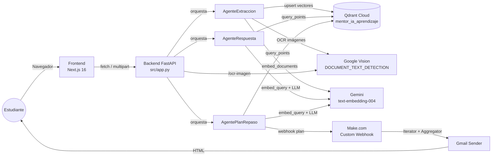

# Documento Técnico — Mentor IA

> Documento técnico del sistema **Mentor IA**, prototipo multiagente con RAG
> para apoyar el estudio mediante consultas sobre documentos propios,
> extracción de texto desde imágenes y generación de planes de repaso
> espaciado.
>
> Asignatura: Administración de Proyectos de Software · Entrega final.
> Versión: 2.0 · Fecha: 2026-05-11.

---

## Tabla de contenidos

1. [Introducción](#1-introducción)
2. [Problema a resolver](#2-problema-a-resolver)
3. [Alcance del proyecto](#3-alcance-del-proyecto)
4. [Arquitectura general del sistema](#4-arquitectura-general-del-sistema)
5. [Stack tecnológico](#5-stack-tecnológico)
6. [Justificación de decisiones técnicas](#6-justificación-de-decisiones-técnicas)
7. [Limitaciones conocidas](#7-limitaciones-conocidas)
8. [Estado funcional actual](#8-estado-funcional-actual)
9. [Documentos complementarios](#9-documentos-complementarios)
10. [Trabajo futuro](#10-trabajo-futuro)
11. [Para defender en sustentación](#11-para-defender-en-sustentación)

---

## 1. Introducción

### 1.1 Contexto

Este documento describe el diseño técnico del sistema **Mentor IA**, un
prototipo académico funcional desarrollado como proyecto de la asignatura
*Administración de Proyectos de Software* de la Universidad Tecnológica de
Pereira.

El sistema combina tres tecnologías que se complementan para apoyar el
estudio individual:

- **Generación aumentada por recuperación (RAG)** sobre documentos propios
  del estudiante para responder preguntas con respaldo bibliográfico.
- **Reconocimiento óptico de caracteres (OCR)** para extraer texto desde
  imágenes y apuntes manuscritos.
- **Repaso espaciado** para generar planes de estudio distribuidos en el
  tiempo (D+1, D+7, D+14, D+30) y entregarlos por correo electrónico.

Estas tres capacidades se orquestan mediante una arquitectura multiagente
en la que cada agente tiene una responsabilidad específica. El detalle del
diseño multiagente se desarrolla en
[`Arquitectura_Multiagente.md`](./Arquitectura_Multiagente.md).

### 1.2 Objetivo del sistema

Proveer al estudiante un asistente de estudio que le permita:

- Consultar sus propios materiales (PDF, TXT, MD, imágenes) con respuestas
  contextualizadas y referencias a la fuente.
- Convertir apuntes escaneados o imágenes de pizarra a texto editable.
- Recibir un plan de repaso espaciado por correo, basado en un tema o
  archivo de su elección.

### 1.3 A quién va dirigido este documento

Este documento es la entrada principal a la documentación técnica del
proyecto. Da una visión global del sistema y enlaza con los documentos
específicos de arquitectura multiagente, modelo de datos vectorial, flujos
de interacción usuario-sistema y diseño del frontend.

---

## 2. Problema a resolver

### 2.1 Desafíos identificados en el aprendizaje individual

El proyecto parte del reconocimiento de cuatro dificultades comunes en el
estudio autónomo a nivel universitario:

1. **Sobrecarga de información.** El estudiante acumula PDF de clase,
   apuntes propios y material complementario. Encontrar un dato específico
   entre decenas de documentos requiere tiempo y, con frecuencia, el dato
   se sabe que existe pero no se recuerda dónde.
2. **Falta de personalización en los recursos.** Los buscadores genéricos
   (Google, ChatGPT) responden con información global, no con el contenido
   de los materiales propios del curso.
3. **Procesamiento manual de apuntes físicos.** El estudiante toma apuntes
   en papel o fotografía pizarras y luego no puede buscar en esos materiales
   porque no son texto digital.
4. **Olvido por falta de repaso estructurado.** Tras estudiar un tema, sin
   un plan de repaso espaciado el material se olvida en pocas semanas
   ([curva del olvido de Ebbinghaus](https://en.wikipedia.org/wiki/Forgetting_curve)).

### 2.2 Propuesta de solución

Mentor IA aborda los cuatro problemas con tres funcionalidades
complementarias:

| Problema                            | Funcionalidad del sistema                          |
| ----------------------------------- | -------------------------------------------------- |
| Sobrecarga de información           | Búsqueda semántica + RAG sobre documentos propios  |
| Falta de personalización            | El estudiante sube sus propios materiales          |
| Procesamiento de apuntes físicos    | OCR con Google Cloud Vision                        |
| Olvido por falta de repaso          | Generación de planes D+1/D+7/D+14/D+30 + email     |

---

## 3. Alcance del proyecto

### 3.1 Qué es este proyecto

Un **prototipo académico funcional** con frontend desplegado en Vercel y
backend desplegable bajo demanda. El sistema es plenamente operativo en un
contexto de uso individual.

### 3.2 Qué NO es este proyecto

Para evitar interpretaciones que excedan el alcance académico, se establecen
explícitamente los siguientes casos fuera de alcance:

- **No es un producto comercial.** No hay planes de monetización, pricing,
  ni estrategia de ventas.
- **No es un SaaS multitenant.** Está diseñado como instancia individual
  para un único usuario por despliegue.
- **No tiene sistema de autenticación.** No hay cuentas de usuario, login,
  ni control de acceso.
- **No es un sustituto del docente o del aula.** Es un asistente de apoyo
  al estudio individual.
- **No está pensado para integrarse con LMS** (Moodle, Canvas) en este
  alcance académico.

### 3.3 Frontera funcional

El sistema acepta archivos en cuatro formatos (PDF, TXT, MD y los formatos
de imagen PNG/JPG/JPEG) y produce tres tipos de salida: respuestas
contextualizadas en chat, texto extraído desde imágenes y planes de repaso
entregados por correo electrónico. Fuera de esa frontera el sistema no
opera.

---

## 4. Arquitectura general del sistema

El sistema sigue una arquitectura por capas con separación clara entre
frontend, backend, agentes especializados, base vectorial y servicios
externos.

### 4.1 Capas del sistema

- **Capa de presentación (Frontend).** Aplicación Next.js desplegada en
  Vercel. Renderiza las pantallas y consume la API REST del backend.
- **Capa de orquestación (Backend).** API FastAPI que expone endpoints
  REST, valida entradas, gestiona el sistema de archivos local para
  documentos cargados y delega la lógica de negocio a los agentes.
- **Capa de agentes.** Tres clases Python especializadas, cada una con su
  responsabilidad. La orquestación entre ellos la realiza el backend; no
  se comunican entre sí directamente.
- **Capa de persistencia.** Qdrant Cloud almacena los vectores
  (embeddings) y sus payloads asociados. El sistema de archivos local del
  backend almacena los documentos originales en `data/ejemplos/`.
- **Capa de servicios externos.** Google Gemini para generación de texto
  y embeddings, Google Cloud Vision para OCR, Make.com como pasarela de
  email.

### 4.2 Patrón de comunicación

Toda la comunicación entre frontend y backend ocurre por HTTPS con cuerpos
JSON. Para subidas de archivos se usa `multipart/form-data` con headers
auxiliares (`X-Filename`). El backend devuelve respuestas JSON
estructuradas con códigos HTTP estándar.

La descripción detallada de cada interacción (qué endpoint hace qué, qué
agentes invoca, qué servicios externos consume) está en
[`Flujo_Interaccion_Usuario_Sistema.md`](./Flujo_Interaccion_Usuario_Sistema.md).

---

## 5. Stack tecnológico

### 5.1 Frontend

| Componente              | Versión / Detalle                                      |
| ----------------------- | ------------------------------------------------------ |
| Framework               | Next.js 16.2.4 con App Router                          |
| Lenguaje                | TypeScript 5                                           |
| Runtime UI              | React 19.2.5                                           |
| Estilos                 | Tailwind CSS 4 (vía `@tailwindcss/postcss`)            |
| Sistema de componentes  | shadcn/ui sobre Radix Primitives                       |
| Íconos                  | lucide-react                                           |
| Utilidades de clase     | `class-variance-authority`, `clsx`, `tailwind-merge`   |
| Despliegue              | Vercel · https://mentor-ia-sistema.vercel.app/         |

### 5.2 Backend

| Componente              | Versión / Detalle                                      |
| ----------------------- | ------------------------------------------------------ |
| Framework web           | FastAPI (Python 3.9+)                                  |
| Servidor ASGI           | Uvicorn                                                |
| Procesamiento PDF       | `pypdf` 6.3.0                                          |
| Cliente Qdrant          | `qdrant-client`                                        |
| Validación              | Pydantic (incluido con FastAPI)                        |
| Cliente HTTP            | `httpx` para llamadas a Gemini, Vision y Make.com      |

### 5.3 Base vectorial

| Aspecto                 | Valor                                                  |
| ----------------------- | ------------------------------------------------------ |
| Servicio                | Qdrant Cloud                                           |
| Colección               | `mentor_ia_aprendizaje`                                |
| Dimensión del vector    | 768                                                    |
| Distancia               | COSINE                                                 |
| Modelo de embeddings    | `text-embedding-004` (Google Gemini)                   |

El detalle del modelo de datos vectorial está en
[`Modelo_Datos_Qdrant.md`](./Modelo_Datos_Qdrant.md).

### 5.4 Servicios de IA externos

| Servicio                          | Uso                                              |
| --------------------------------- | ------------------------------------------------ |
| Google Gemini `gemini-flash-latest` | Generación de respuestas y planes de repaso     |
| Google Gemini `text-embedding-004`  | Generación de vectores de 768 dimensiones       |
| Google Cloud Vision                 | OCR con `DOCUMENT_TEXT_DETECTION`                |

### 5.5 Automatización

| Servicio                          | Uso                                              |
| --------------------------------- | ------------------------------------------------ |
| Make.com (Custom Webhook)         | Recibir el plan de repaso generado por el sistema |
| Make.com (Iterator + Aggregator)  | Formatear cada sesión del plan                   |
| Gmail Sender (módulo de Make.com) | Enviar el correo HTML al estudiante              |

---

## 6. Justificación de decisiones técnicas

Esta sección documenta el porqué de las elecciones técnicas más relevantes.
Es fundamental para evaluar el criterio de ingeniería más allá del
funcionamiento.

### 6.1 ¿Por qué arquitectura multiagente y no monolítica?

Se eligió separar la lógica en tres agentes en lugar de funciones sueltas
dentro de un único módulo por tres razones:

- **Responsabilidades aisladas.** Cada agente encapsula un tipo de tarea
  (ingesta, respuesta, planificación), lo que reduce el acoplamiento y
  facilita el mantenimiento.
- **Pruebas más simples.** Cada agente se puede testear de forma
  independiente sin necesidad de levantar todo el stack.
- **Escalabilidad de conocimiento.** Si en el futuro se añade un cuarto
  comportamiento (por ejemplo, evaluación automática), basta con sumar un
  agente más sin modificar los existentes.

El detalle de la arquitectura multiagente está en
[`Arquitectura_Multiagente.md`](./Arquitectura_Multiagente.md).

### 6.2 ¿Por qué Qdrant y no otra base vectorial?

Se evaluaron tres opciones principales: Qdrant Cloud, Pinecone y Chroma.

| Criterio                           | Qdrant     | Pinecone   | Chroma     |
| ---------------------------------- | ---------- | ---------- | ---------- |
| Tier gratuito                      | Sí (1 GB)  | Sí (limitado) | Sí (local) |
| API Python madura                  | Sí         | Sí         | Sí         |
| Filtros por payload                | Sí         | Sí         | Parcial    |
| Documentación en español           | Limitada   | Limitada   | Limitada   |
| Soporte cloud sin self-hosting     | Sí         | Sí         | No (local) |

Se eligió **Qdrant Cloud** porque combina tier gratuito útil para
prototipo, cliente Python estable, filtros expresivos por payload y la
posibilidad de migrar a self-hosted si el proyecto creciera. Pinecone es
comparable en funcionalidad pero su tier gratuito es más restrictivo en
operaciones. Chroma se descartó porque requeriría correr la base vectorial
junto al backend, complicando el despliegue.

### 6.3 ¿Por qué Gemini y no OpenAI?

Se eligió **Google Gemini** principalmente porque:

- Ofrece un tier gratuito real con suficiente cuota para un proyecto
  académico.
- El modelo de embeddings (`text-embedding-004`) es gratuito hasta un
  límite generoso.
- El servicio OCR de Google Cloud (Vision) se integra naturalmente con
  el ecosistema Google Cloud, evitando configurar otro proveedor.

OpenAI ofrece modelos más potentes en algunos benchmarks, pero requiere
saldo prepago desde el primer uso y su API de embeddings tiene costo.

### 6.4 ¿Por qué 768 dimensiones y distancia coseno?

La dimensión 768 no es una decisión libre: la impone el modelo
`text-embedding-004`. Cualquier vector almacenado en la colección debe
tener exactamente esa dimensión, o Qdrant rechaza la inserción.

La distancia **COSINE** se eligió porque:

- Es la métrica nativa para embeddings semánticos: mide similitud de
  dirección entre vectores, ignorando la magnitud.
- Funciona bien con embeddings normalizados (que es como los entrega
  Gemini).
- Es la métrica recomendada por la propia documentación de Google para
  `text-embedding-004`.

Las alternativas (euclidiana, producto punto) serían válidas pero menos
apropiadas para texto.

### 6.5 ¿Por qué chunks de 900 caracteres con 150 de solape?

La decisión balancea dos fuerzas opuestas:

- **Chunks pequeños** dan respuestas más precisas (cada chunk es
  granular), pero pierden contexto.
- **Chunks grandes** preservan contexto pero diluyen la respuesta entre
  texto irrelevante.

900 caracteres equivale aproximadamente a un párrafo medio en español, y
150 caracteres de solape evita perder oraciones que queden partidas entre
dos chunks. El límite de 100 chunks por documento es una salvaguarda
contra documentos extremadamente largos que podrían saturar la cuota de
embeddings.

La justificación detallada está en
[`Modelo_Datos_Qdrant.md`](./Modelo_Datos_Qdrant.md).

### 6.6 ¿Por qué repaso espaciado D+1, D+7, D+14, D+30?

Esta cadencia es una aproximación práctica al
[método SuperMemo SM-2](https://en.wikipedia.org/wiki/SuperMemo) y a la
[curva del olvido de Ebbinghaus](https://en.wikipedia.org/wiki/Forgetting_curve).
Cada repaso refuerza la memoria justo antes del olvido esperado, alargando
progresivamente el intervalo. No se implementó un algoritmo adaptativo
(que ajuste el intervalo según el desempeño del estudiante) porque eso
requeriría un sistema de seguimiento de progreso fuera del alcance del
prototipo.

---

## 7. Limitaciones conocidas

Documentar las limitaciones honestamente es parte del criterio de
ingeniería. El sistema actual tiene las siguientes limitaciones, todas
identificadas durante el desarrollo:

### 7.1 Limitaciones funcionales

- **No hay autenticación.** Cualquier persona con la URL puede usar el
  frontend. Esto es intencional para el alcance académico; se documenta
  como mejora futura.
- **No hay control de cuotas.** Un usuario podría subir cientos de
  documentos consecutivos y agotar la cuota gratuita de Gemini.
- **Los chunks viejos no se borran al re-subir un documento.** Si se sube
  `apuntes.pdf` dos veces, los chunks del primer upload quedan huérfanos
  en Qdrant. Esto se debe a que el `point_id` actual no es idempotente
  (ver [`Modelo_Datos_Qdrant.md`](./Modelo_Datos_Qdrant.md), sección 5).

### 7.2 Limitaciones técnicas

- **No hay procesamiento asíncrono real.** Los endpoints son síncronos.
  Una subida grande bloquea la respuesta hasta que termine la indexación.
- **No hay tests automatizados.** Las validaciones se hicieron de forma
  manual. Es una deuda técnica reconocida.
- **No hay observabilidad estructurada.** El logging se hace con `print()`
  en lugar de un logger configurado, lo que dificulta debugging en
  producción.
- **CORS está permisivo en desarrollo y restrictivo en producción.** En
  producción solo se permite el dominio `mentor-ia-sistema.vercel.app`.
  Cualquier otro frontend que quisiera consumir la API sería rechazado.
- **El indicador "Online" del header es decorativo.** No consulta el
  endpoint `/health`. Es un punto de mejora documentado.

### 7.3 Limitaciones de robustez

- **Si Qdrant falla, el sistema devuelve 500 sin mensaje útil.** Falta
  manejo explícito de la excepción.
- **El correo del plan de repaso se envía con respuesta 200 incluso si
  Make.com falla.** El backend no espera confirmación de Gmail antes de
  responder. Si la URL del webhook caduca, el usuario no se entera.
- **No hay validación de email en el endpoint `/plan-repaso`.** Se acepta
  cualquier string como destinatario.

---

## 8. Estado funcional actual

A la fecha de esta entrega, el sistema cumple los 10 requisitos
funcionales definidos en el documento de requerimientos:

| RF  | Funcionalidad                                          | Estado        |
| --- | ------------------------------------------------------ | ------------- |
| RF1 | Consulta RAG sobre documentos indexados                | Implementado  |
| RF2 | Carga e indexación de PDF, TXT, MD                     | Implementado  |
| RF3 | Búsqueda semántica con embeddings                      | Implementado  |
| RF4 | OCR de imágenes (PNG, JPG, JPEG)                       | Implementado  |
| RF5 | Generación de plan de repaso espaciado D+1/+7/+14/+30  | Implementado  |
| RF6 | Envío del plan por email vía Make.com                  | Implementado  |
| RF7 | Visualización de documentos indexados                  | Implementado  |
| RF8 | UI responsive con tres módulos (Contexto / Documentos / OCR) | Implementado |
| RF9 | API REST                                               | Implementado  |
| RF10| Endpoint `/health`                                     | Implementado  |

**Frontend desplegado:** https://mentor-ia-sistema.vercel.app/ (operativo).

**Backend:** desplegable bajo demanda. El despliegue continuo previo en
Railway se descontinuó por inactividad; el backend está listo para
re-desplegar en cualquier plataforma compatible con Python/FastAPI (se
está evaluando DigitalOcean Droplet con Docker Compose para la
sustentación final).

---

## 9. Documentos complementarios

Este documento técnico es la entrada principal. La profundización de cada
aspecto se documenta en archivos especializados:

| Documento                                                  | Contenido                                            |
| ---------------------------------------------------------- | ---------------------------------------------------- |
| [Arquitectura_Multiagente.md](./Arquitectura_Multiagente.md) | Diseño detallado de los tres agentes y su coordinación |
| [Modelo_Datos_Qdrant.md](./Modelo_Datos_Qdrant.md)         | Esquema vectorial, payload, chunking, justificaciones |
| [Flujo_Interaccion_Usuario_Sistema.md](./Flujo_Interaccion_Usuario_Sistema.md) | Endpoints, diagramas de secuencia, casos felices y de error |
| [wireframes-frontend.md](./wireframes-frontend.md)         | Pantallas del frontend, sistema de layout, responsive |

---

## 10. Trabajo futuro

Las siguientes mejoras se identificaron durante el desarrollo pero quedan
fuera del alcance académico de este corte. Se listan en orden aproximado
de valor/esfuerzo:

1. **Idempotencia en la ingesta.** Cambiar el `point_id` de
   `uuid.uuid4().int >> 64` a UUIDv5 determinístico para evitar
   duplicados al re-indexar un mismo documento.
2. **Healthcheck real en el indicador "Online".** Hacer que el badge del
   header consulte periódicamente el endpoint `/health` y refleje el
   estado real del backend.
3. **Manejo de errores granular.** Distinguir errores de Qdrant, Gemini,
   Vision y Make.com en las respuestas, en lugar de un 500 genérico.
4. **Borrado de chunks huérfanos al re-subir un documento.** Antes de
   re-indexar, eliminar los chunks previos asociados al mismo
   `source_path`.
5. **Validación de email con `EmailStr` de Pydantic** en el endpoint
   `/plan-repaso`.
6. **Logging estructurado** (JSON con `loguru` o `structlog`) en lugar
   de `print()`.
7. **Pruebas unitarias** para cada agente, con mocks de Qdrant, Gemini
   y Vision.
8. **Tests de extremo a extremo** del flujo de carga → consulta →
   respuesta.

Lo que **no** se contempla como trabajo futuro porque excede el alcance
académico: monetización, multitenant, autenticación con JWT,
integraciones con LMS, app móvil nativa, fine-tuning de modelos propios.

---

## 11. Para defender en sustentación

Cuatro puntos clave que deben quedar claros al exponer este documento:

1. **El proyecto es un prototipo académico funcional, no un producto
   comercial.** Esta frontera se respeta en todas las decisiones de
   diseño. Si surge una pregunta tipo "¿cómo lo monetizaría?", la
   respuesta correcta es "está fuera del alcance académico de esta
   entrega; el trabajo futuro listado en la sección 10 prioriza calidad
   técnica, no monetización".

2. **Las decisiones técnicas tienen justificación, no son arbitrarias.**
   Qdrant se eligió frente a Pinecone y Chroma por una combinación
   específica de tier gratuito, filtros por payload y opción de
   self-hosting. La dimensión 768 la impone el modelo de embeddings, no
   es libre. La cadencia D+1/D+7/D+14/D+30 se inspira en SuperMemo.

3. **Las limitaciones están documentadas honestamente.** No tener tests,
   no tener autenticación y no tener procesamiento asíncrono no son
   omisiones ocultas: son decisiones de alcance reconocidas en la
   sección 7. Reconocerlas es parte del criterio de ingeniería, no una
   debilidad.

4. **El sistema cumple los 10 requisitos funcionales del documento de
   requerimientos.** El cumplimiento se verifica abriendo el frontend en
   Vercel y, con el backend corriendo, ejecutando los flujos completos
   (subir documento → consultar → recibir respuesta con fuentes; generar
   plan → recibir email).

---

_Última actualización: 2026-05-11._
