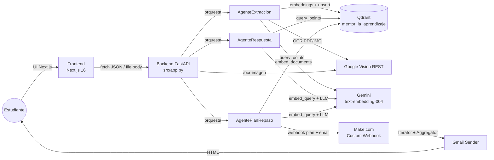
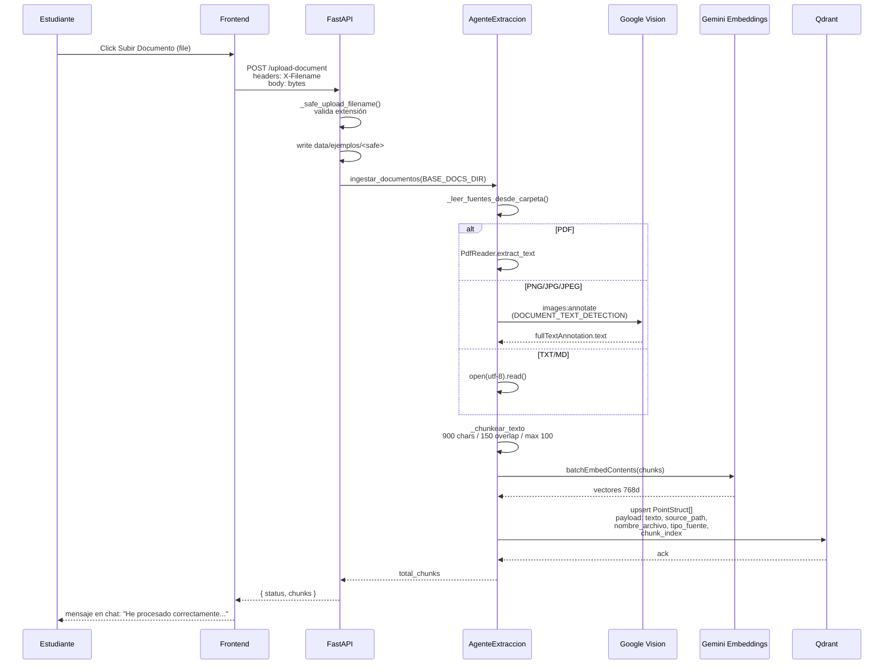
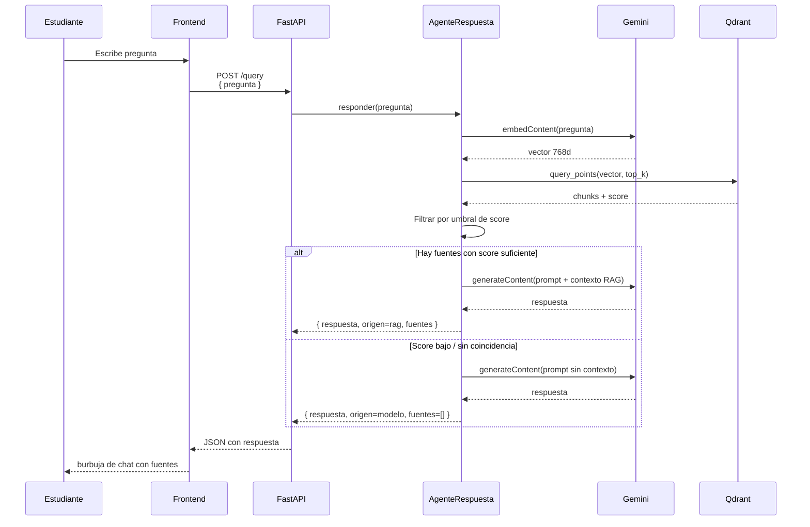
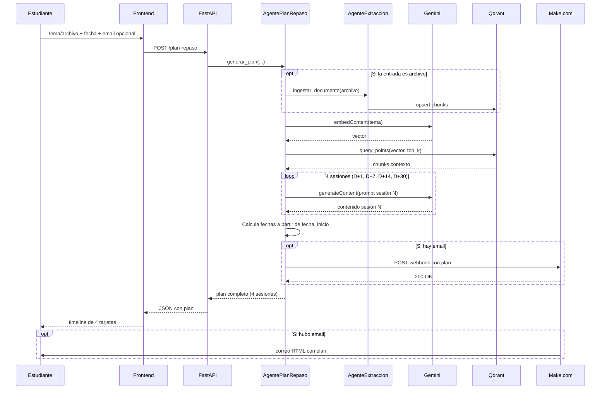
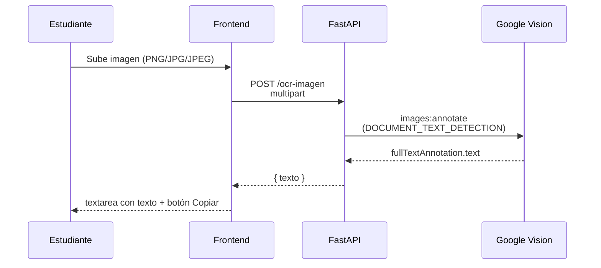
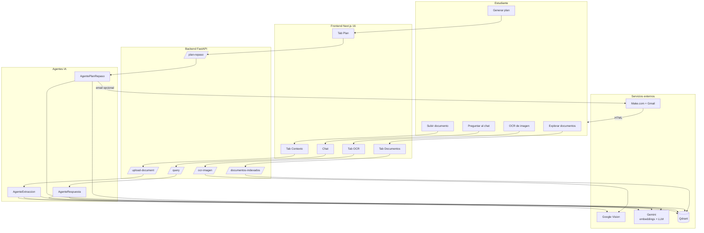

# Flujo de interacción usuario-sistema — Mentor IA

> Documento de referencia funcional y técnico que describe cómo interactúan
> el estudiante, el frontend Next.js, el backend FastAPI, los agentes de
> IA, la base vectorial Qdrant y los servicios externos (Google Gemini,
> Google Cloud Vision y Make.com) en el sistema **Mentor IA**.
>
> Sirve como base para entender el comportamiento real del sistema y
> auditar la coherencia entre lo documentado y lo implementado.
>
> Versión: 2.0 · Fecha: 2026-05-11.
> Tarea ClickUp: Definición del flujo de interacción usuario-sistema.

---

## Tabla de contenidos

1. [Resumen ejecutivo](#1-resumen-ejecutivo)
2. [Flujo funcional (perspectiva del usuario)](#2-flujo-funcional-perspectiva-del-usuario)
3. [Flujo técnico: Frontend → Backend → Agentes → Qdrant → Externos](#3-flujo-técnico-frontend--backend--agentes--qdrant--externos)
4. [Datos que viajan entre módulos](#4-datos-que-viajan-entre-módulos)
5. [Casos felices, errores y validaciones faltantes](#5-casos-felices-errores-y-validaciones-faltantes)
6. [Mejoras propuestas (no implementadas en este corte)](#6-mejoras-propuestas-no-implementadas-en-este-corte)
7. [Resumen visual final](#7-resumen-visual-final)
8. [Referencias rápidas al código](#8-referencias-rápidas-al-código)
9. [Para defender en sustentación](#9-para-defender-en-sustentación)

> **Nota sobre el alcance.** Este documento describe el flujo del sistema
> en su estado actual como **prototipo académico funcional**, no como
> producto en producción. Las mejoras propuestas en la sección 6 se
> identifican como trabajo futuro, no como funcionalidades implementadas.

---

## 1. Resumen ejecutivo

Mentor IA es un sistema multiagente de aprendizaje basado en RAG. El
estudiante sube documentos (PDF, TXT, MD, imágenes), pregunta sobre
ellos en un chat, genera planes de repaso espaciado y los recibe
automáticamente por email vía Make.com.

El sistema se compone de cinco capas:



Stack confirmado:

- **Frontend:** Next.js 16.2.4 + React 19.2.5 + TypeScript 5 + Tailwind
  CSS 4 + shadcn/ui (sobre Radix Primitives) + lucide-react.
- **Backend:** FastAPI + Python 3.9+ (`mentor-ia-aprendizaje/src/app.py`).
- **Base vectorial:** Qdrant Cloud, colección `mentor_ia_aprendizaje`,
  768 dimensiones, distancia COSINE.
- **LLM y embeddings:** Google Gemini (`gemini-flash-latest`,
  `text-embedding-004`).
- **OCR:** Google Cloud Vision (`DOCUMENT_TEXT_DETECTION` por REST).
- **Automatización:** Make.com (webhook + iterator + aggregator + Gmail).

---

## 2. Flujo funcional (perspectiva del usuario)

### 2.1 Estructura de la UI

El header global y la navegación principal viven en
[`app/page.tsx`](../mentor-ia-sistema/mentor-ia-frontend/app/page.tsx),
con dos tabs raíz: **Asistente de Estudio** y **Plan de Repaso**.

Dentro de **Asistente de Estudio** (componente
[`StudyAssistant`](../mentor-ia-sistema/mentor-ia-frontend/components/study-assistant.tsx))
hay tres sub-pestañas en la columna izquierda:

| Sub-pestaña   | Acción principal                                                    |
| ------------- | ------------------------------------------------------------------- |
| `Contexto`    | Subir documentos y disparar consultas de ejemplo.                   |
| `Documentos`  | Listar los documentos ya indexados en Qdrant con su número de chunks. |
| `OCR`         | Subir una imagen y extraer su texto al portapapeles.                |

La pestaña **Plan de Repaso** (componente
[`ReviewPlan`](../mentor-ia-sistema/mentor-ia-frontend/components/review-plan.tsx))
ofrece dos modos: `Tema` (texto libre) o `Archivo` (subir un PDF/TXT/MD
que se indexa antes de generar el plan).

### 2.2 Recorrido típico

1. **Aterrizaje.** El estudiante abre la app, ve el branding "Mentor IA"
   y un indicador `Online` (decorativo, no consulta `/health`).
2. **Cargar conocimiento.** En `Contexto` hace clic en *Subir Documento*
   y selecciona un archivo soportado (PDF, TXT, MD, JPG, PNG). El
   sistema confirma con un mensaje en el chat: *"He procesado
   correctamente el archivo: …"*.
3. **Consultar.** Escribe una pregunta o usa una de las sugerencias
   hardcodeadas (`EXAMPLE_QUERIES`). La respuesta llega como burbuja de
   chat con cabecera de fuentes (`archivo · chunk · score`).
4. **Explorar lo indexado.** Cambia a `Documentos` y ve la lista real
   desde Qdrant (nombre, chunks, tipo). El icono de "ojo" está
   renderizado pero **sin handler** (mejora pendiente).
5. **OCR puntual.** En `OCR` sube una imagen y obtiene el texto extraído
   con un botón *Copiar* al portapapeles.
6. **Plan de repaso.** En la pestaña principal `Plan de Repaso` elige
   modo `Tema` o `Archivo`, ingresa tema, fecha de inicio y email
   opcionales y pulsa *Generar Plan de Repaso*. Recibe en pantalla una
   **timeline** con sesiones D+1, D+7, D+14, D+30 y, si proporcionó
   email, recibe un correo HTML enviado por Make.com.

### 2.3 Estados visibles al usuario

- **Cargando:** skeletons (`PlanCard`) o tres puntos animados en el chat.
- **Éxito:** tarjetas pobladas, badges con `D+N` y fechas localizadas.
- **Vacío:** textos neutros (*"No hay documentos indexados"*, *"¿En qué
  puedo ayudarte hoy?"*).
- **Error:** `Alert` rojo con mensaje genérico, sin distinguir causa raíz.

---

## 3. Flujo técnico: Frontend → Backend → Agentes → Qdrant → Externos

### 3.1 Mapa de endpoints

Todos los endpoints viven en
[`src/app.py`](../mentor-ia-sistema/mentor-ia-aprendizaje/src/app.py).

| Método | Ruta                       | Propósito                                            |
| ------ | -------------------------- | ---------------------------------------------------- |
| GET    | `/health`                  | Smoke test (`{ "status": "ok" }`).                   |
| GET    | `/list-docs`               | Lista archivos físicos en `data/ejemplos`.           |
| GET    | `/documentos-indexados`    | Scroll en Qdrant agrupando por `source_path`.        |
| POST   | `/upload-document`         | Guarda en disco y re-ingesta toda la carpeta.        |
| POST   | `/ingestar`                | Dispara re-ingesta sobre `BASE_DOCS_DIR`.            |
| POST   | `/query`                   | Consulta RAG (`AgenteRespuesta`).                    |
| POST   | `/plan-repaso`             | Plan de repaso (`AgentePlanRepaso`).                 |
| POST   | `/ocr-imagen`              | OCR puntual (no indexa).                             |
| POST   | `/webhook/plan-generado`   | Receptor placeholder (sólo loggea).                  |

CORS está limitado a `localhost:3000`, `127.0.0.1:3000` y
`https://mentor-ia-sistema.vercel.app`.

### 3.2 Carga e indexación de documentos



### 3.3 Consulta RAG



### 3.4 Generación de plan de repaso



### 3.5 OCR puntual



---

## 4. Datos que viajan entre módulos

### 4.1 Frontend → Backend

| Endpoint              | Payload                                                          |
| --------------------- | ---------------------------------------------------------------- |
| `POST /upload-document` | Body: bytes del archivo. Header `X-Filename` con el nombre.    |
| `POST /query`         | JSON `{ "pregunta": "..." }`                                     |
| `POST /plan-repaso`   | JSON `{ "tema": "...", "fecha_inicio": "...", "email": "..."? }` o multipart con archivo |
| `POST /ocr-imagen`    | Multipart con la imagen                                          |
| `POST /ingestar`      | (sin body)                                                       |

### 4.2 Backend → Frontend

| Endpoint                | Respuesta                                                       |
| ----------------------- | --------------------------------------------------------------- |
| `GET /health`           | `{ "status": "ok" }`                                            |
| `GET /documentos-indexados` | `{ documentos: [...], total_chunks, total_documentos }`     |
| `POST /upload-document` | `{ status, archivo, chunks_ingresados }`                        |
| `POST /query`           | `{ respuesta, origen: "rag"\|"modelo", fuentes: [...] }`        |
| `POST /plan-repaso`     | `{ tema, fecha_inicio, sesiones: [...], email_enviado? }`       |
| `POST /ocr-imagen`      | `{ texto }`                                                     |

### 4.3 Backend → Make.com

Payload del webhook `MAKE_WEBHOOK_URL`:

```json
{
  "tema": "...",
  "fecha_inicio": "...",
  "email": "...",
  "sesiones": [
    {
      "tipo": "D+1",
      "fecha": "...",
      "titulo": "...",
      "descripcion": [...]
    },
    ...
  ]
}
```

Make.com itera las cuatro sesiones, formatea cada una como HTML y arma
un correo único con Gmail Sender.

---

## 5. Casos felices, errores y validaciones faltantes

### 5.1 Carga de documento (`/upload-document`)

| Caso                                                  | Resultado                                          |
| ----------------------------------------------------- | -------------------------------------------------- |
| Happy PDF/TXT/MD/imagen válido                        | `chunks_ingresados > 0`                            |
| Extensión no soportada                                | `400 Bad Request`                                  |
| PDF escaneado sin capa de texto                       | `chunks_ingresados = 0`, sin mensaje claro al usuario |
| Mismo archivo subido dos veces                        | Se duplican chunks (no idempotente)                |
| Archivo enorme (>100 chunks)                          | Se trunca a los primeros 100 chunks                |

### 5.2 Consulta (`/query`)

| Caso                                                   | Resultado                                              |
| ------------------------------------------------------ | ------------------------------------------------------ |
| Happy con documentos relevantes                        | `origen = "rag"` con `fuentes` no vacío                |
| Happy sin documentos / score bajo / sin coincidencia léxica | `origen = "modelo"`, `fuentes = []`               |
| `respuesta_llm.content` viene como lista de partes     | Normalizado a string en `responder()`                  |
| Qdrant caído                                           | Excepción no capturada → `500`                         |
| Sin validación de longitud de `pregunta`               | Un usuario podría enviar 100 000 chars                 |
| Bug visual del frontend                                | En `study-assistant.tsx` se imprime `score: ... pregunta` por concatenar `msg.response?.pregunta` |

### 5.3 Plan de repaso (`/plan-repaso`)

| Caso                                                   | Resultado                                              |
| ------------------------------------------------------ | ------------------------------------------------------ |
| Happy con email                                        | 4 sesiones + webhook 200                               |
| Happy sin email                                        | Plan generado, no hay envío                            |
| 1 de 4 llamadas Gemini falla                           | `500` y se pierden las sesiones ya generadas           |
| Make.com caído o `MAKE_WEBHOOK_URL` ausente            | El endpoint responde 200 igualmente; **el usuario no se entera** |
| `descripcion` polimórfico                              | El frontend lo soporta (`SesionDescripcionBlock[]`); Make.com necesita la fórmula `replace(ifempty(first(map(flatten(...)))))` |
| Email sin formato válido                               | Aceptado (no hay `EmailStr`)                           |
| `fecha_inicio` muy antigua o futura                    | Aceptada sin validación                                |

### 5.4 Exploración (`/documentos-indexados`)

| Caso                                  | Resultado                                                          |
| ------------------------------------- | ------------------------------------------------------------------ |
| Happy                                 | `total_chunks > 0` y lista poblada                                 |
| Qdrant da timeout                     | Devuelve `{ documentos: [], total_chunks: 0, total_documentos: 0 }`, **indistinguible del estado vacío** |
| `scroll(limit=10000)` no pagina       | No escala con muchos puntos                                        |
| Botón `Eye` sin handler               | Feature pendiente                                                  |

### 5.5 Validaciones que faltan (resumen)

| Capa                       | Validación faltante                                              |
| -------------------------- | ---------------------------------------------------------------- |
| `/upload-document`         | Tamaño máximo, MIME real (no sólo extensión)                     |
| `/upload-document`         | Borrar chunks previos del mismo `source_path` antes de upsertear |
| `/query`                   | Longitud mínima/máxima de `pregunta`, sanitización               |
| `/plan-repaso`             | `EmailStr`, `fecha_inicio` razonable, `tema` no vacío            |
| `/ocr-imagen`              | Extensión + tamaño máximo, MIME real                             |
| Backend                    | Rate limiting y CORS más restrictivo en producción               |
| Frontend                   | Comprobar `File.type` antes de subir (no sólo `accept` del input) |

---

## 6. Mejoras propuestas (no implementadas en este corte)

Esta sección lista mejoras identificadas durante el desarrollo. **No
están implementadas** y se documentan como trabajo futuro priorizado:

1. **Healthcheck real en el indicador "Online".** El badge del header
   debería consultar periódicamente `GET /health` en lugar de ser
   decorativo.
2. **Mensaje claro cuando un PDF no tiene texto extraíble.** Hoy
   devuelve `chunks_ingresados: 0` sin explicación; debería sugerir al
   estudiante usar OCR.
3. **Validación de email con Pydantic.** Usar `EmailStr` y avisar al
   frontend antes de enviar.
4. **Eliminar el bug visual `score: ... pregunta`** en
   [`study-assistant.tsx`](../mentor-ia-sistema/mentor-ia-frontend/components/study-assistant.tsx).
5. **Badges de origen en cada respuesta del chat.** Mostrar `RAG · 3
   fuentes` vs `Conocimiento general`. Los campos `origen` y
   `detalle_origen` ya se reciben del backend pero no se muestran.
6. **Logging estructurado** (JSON con `loguru` o `structlog`)
   reemplazando los `print()` sueltos del backend.
7. **`request_id` end-to-end** propagado entre frontend, backend y
   Make.com para correlacionar errores.
8. **Healthcheck profundo** (`/health/deep`) que verifique Qdrant,
   Gemini y Vision con un canario.

---

## 7. Resumen visual final



---

## 8. Referencias rápidas al código

- Endpoints: [`mentor-ia-aprendizaje/src/app.py`](../mentor-ia-sistema/mentor-ia-aprendizaje/src/app.py)
- Agente de extracción:
  [`mentor-ia-aprendizaje/src/agentes/agente_extraccion.py`](../mentor-ia-sistema/mentor-ia-aprendizaje/src/agentes/agente_extraccion.py)
- Agente de respuesta (RAG):
  [`mentor-ia-aprendizaje/src/agentes/agente_respuesta.py`](../mentor-ia-sistema/mentor-ia-aprendizaje/src/agentes/agente_respuesta.py)
- Agente de plan de repaso:
  [`mentor-ia-aprendizaje/src/agentes/agente_plan_repaso.py`](../mentor-ia-sistema/mentor-ia-aprendizaje/src/agentes/agente_plan_repaso.py)
- OCR Vision: [`mentor-ia-aprendizaje/src/ocr_vision.py`](../mentor-ia-sistema/mentor-ia-aprendizaje/src/ocr_vision.py)
- Qdrant + embeddings: [`mentor-ia-aprendizaje/src/embeddings.py`](../mentor-ia-sistema/mentor-ia-aprendizaje/src/embeddings.py)
- Búsqueda semántica: [`mentor-ia-aprendizaje/src/similitud.py`](../mentor-ia-sistema/mentor-ia-aprendizaje/src/similitud.py)
- UI principal: [`mentor-ia-frontend/app/page.tsx`](../mentor-ia-sistema/mentor-ia-frontend/app/page.tsx)
- Asistente: [`mentor-ia-frontend/components/study-assistant.tsx`](../mentor-ia-sistema/mentor-ia-frontend/components/study-assistant.tsx)
- Plan de repaso: [`mentor-ia-frontend/components/review-plan.tsx`](../mentor-ia-sistema/mentor-ia-frontend/components/review-plan.tsx)
- Cliente API: [`mentor-ia-frontend/lib/api.ts`](../mentor-ia-sistema/mentor-ia-frontend/lib/api.ts)
- Tipos compartidos: [`mentor-ia-frontend/lib/types.ts`](../mentor-ia-sistema/mentor-ia-frontend/lib/types.ts)

> **Nota:** la referencia a un archivo `google_ai.py` que aparecía en una
> versión previa de este documento se eliminó. Las llamadas a Gemini se
> realizan directamente en `embeddings.py` (para los vectores) y dentro
> de cada agente (para los `generateContent`).

---

## 9. Para defender en sustentación

Cuatro puntos clave sobre el flujo de interacción:

1. **El sistema expone nueve endpoints REST y todos cumplen una función
   específica.** No hay endpoints "decorativos". El más visible es
   `/query` para RAG; los menos visibles (`/health`,
   `/webhook/plan-generado`) sostienen el sistema. La tabla en la
   sección 3.1 los lista todos.

2. **La carga de un documento dispara una cadena de cuatro pasos
   técnicos.** Lectura del archivo, chunking 900/150, generación de
   embeddings con Gemini, y upsert en Qdrant. Si la profesora pregunta
   "¿qué pasa cuando subo un PDF?", el diagrama de la sección 3.2 es la
   respuesta exacta.

3. **Las respuestas distinguen entre RAG y modelo.** El campo `origen`
   indica si la respuesta vino con respaldo bibliográfico de los
   documentos indexados (`rag`) o si Gemini respondió desde su
   conocimiento general (`modelo`). Esto es transparencia explícita y
   se documenta en la sección 5.2.

4. **Hay validaciones que faltan, reconocidas honestamente.** No hay
   tamaño máximo de archivo, no hay `EmailStr` para el plan de repaso,
   no hay rate limiting. Esto se lista en la sección 5.5 y las mejoras
   priorizadas están en la sección 6. Reconocerlas demuestra criterio
   técnico, no es una debilidad.

---

_Última actualización: 2026-05-11._
