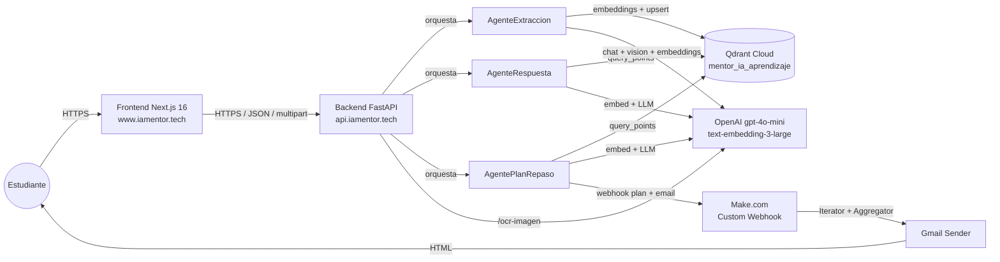
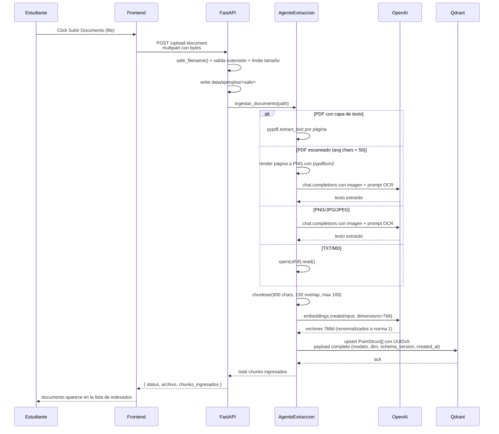
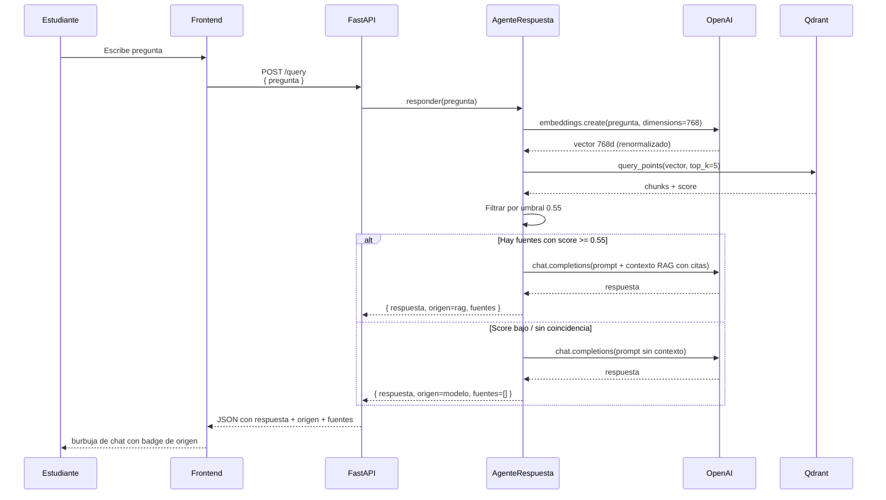
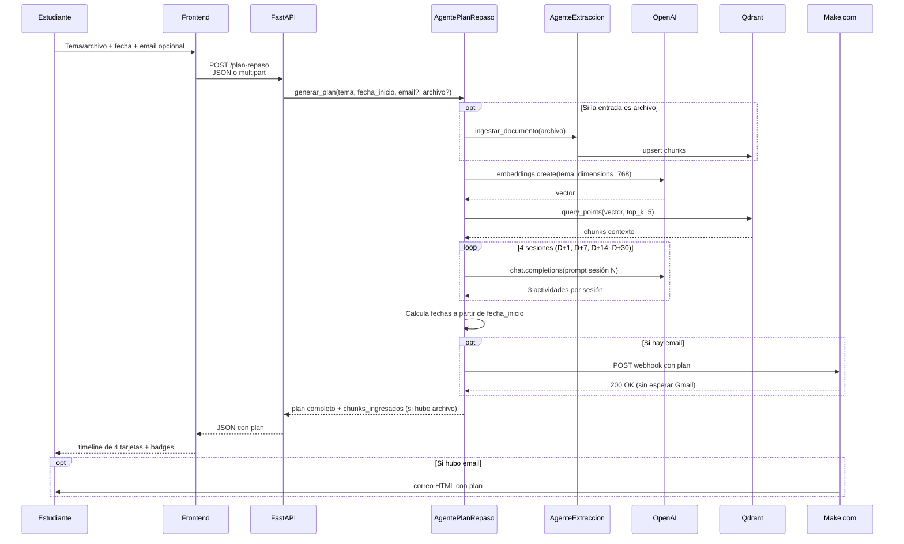
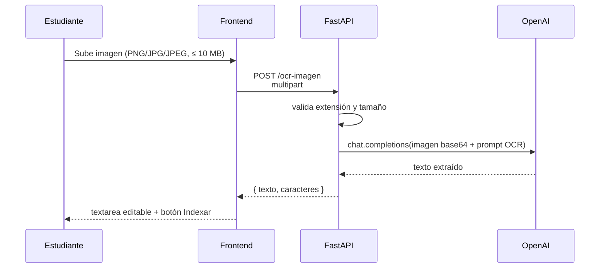
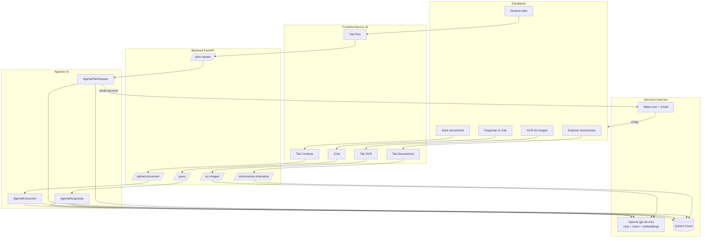

# Flujo de interacción usuario-sistema — Mentor IA

> Documento de referencia funcional y técnico que describe cómo
> interactúan el estudiante, el frontend Next.js, el backend FastAPI,
> los agentes especializados, la base vectorial Qdrant y los servicios
> externos (OpenAI y Make.com) en el sistema **Mentor IA**.
>
> Sirve como base para entender el comportamiento real del sistema y
> auditar la coherencia entre lo documentado y lo implementado.
>
> Versión: 3.0 · Fecha: 2026-05-17.

---

## Tabla de contenidos

1. [Resumen ejecutivo](#1-resumen-ejecutivo)
2. [Flujo funcional (perspectiva del usuario)](#2-flujo-funcional-perspectiva-del-usuario)
3. [Flujo técnico: Frontend → Backend → Agentes → Qdrant → Externos](#3-flujo-técnico-frontend--backend--agentes--qdrant--externos)
4. [Datos que viajan entre módulos](#4-datos-que-viajan-entre-módulos)
5. [Casos felices, errores y validaciones](#5-casos-felices-errores-y-validaciones)
6. [Estado de mejoras (implementadas y pendientes)](#6-estado-de-mejoras-implementadas-y-pendientes)
7. [Resumen visual final](#7-resumen-visual-final)
8. [Referencias rápidas al código](#8-referencias-rápidas-al-código)
9. [Para defender en sustentación](#9-para-defender-en-sustentación)

---

## 1. Resumen ejecutivo

Mentor IA es un sistema multiagente de aprendizaje basado en RAG. El
usuario sube documentos (PDF, TXT, MD, imágenes), pregunta sobre
ellos en un chat con citación de fuentes, genera planes de repaso
espaciado y los recibe automáticamente por correo vía Make.com.

El sistema se compone de cinco capas:



Stack confirmado:

- **Frontend:** Next.js 16.2.6 + React 19.2.4 + TypeScript 5 + Tailwind
  CSS 4 + shadcn/ui (sobre Radix Primitives) + lucide-react, desplegado
  en Vercel (<https://www.iamentor.tech>).
- **Backend:** FastAPI + Python 3.11+ (`backend/src/app.py`), Docker
  Compose en DigitalOcean Droplet Ubuntu 24.04 con nginx + Let's
  Encrypt (<https://api.iamentor.tech>).
- **Base vectorial:** Qdrant Cloud, colección `mentor_ia_aprendizaje`,
  768 dimensiones, distancia COSINE.
- **LLM, embeddings y OCR:** OpenAI 100% (`gpt-4o-mini` para chat y
  vision multimodal, `text-embedding-3-large` con `dimensions=768` y
  renormalización a norma 1; ver
  [`Documento_Tecnico.md`](./Documento_Tecnico.md) §6.7 para el
  historial de migraciones).
- **Automatización:** Make.com (webhook + iterator + aggregator + Gmail).

---

## 2. Flujo funcional (perspectiva del usuario)

### 2.1 Estructura de la UI

El header global y la navegación principal viven en
[`app/page.tsx`](../../frontend/app/page.tsx), con dos tabs raíz:
**Asistente de Estudio** y **Plan de Repaso**.

Dentro de **Asistente de Estudio** (componente
[`StudyAssistant`](../../frontend/components/study-assistant.tsx))
hay tres sub-pestañas en la columna izquierda:

| Sub-pestaña   | Acción principal                                                      |
| ------------- | --------------------------------------------------------------------- |
| `Contexto`    | Subir documentos y disparar consultas de ejemplo.                     |
| `Documentos`  | Listar los documentos ya indexados en Qdrant con su número de chunks. |
| `OCR`         | Subir una imagen, extraer su texto e indexarlo como TXT si se desea.  |

La pestaña **Plan de Repaso** (componente
[`ReviewPlan`](../../frontend/components/review-plan.tsx))
ofrece dos modos: `Tema` (texto libre) o `Archivo` (subir un PDF/TXT/MD
que se indexa antes de generar el plan).

### 2.2 Recorrido típico

1. **Aterrizaje.** El usuario abre la app, ve el branding "Mentor IA"
   y un indicador `Online` en el header que consulta `/health` cada
   30 s y refleja el estado real del backend.
2. **Cargar conocimiento.** En `Contexto` hace clic en *Subir Documento*
   y selecciona un archivo soportado (PDF, TXT, MD, JPG, PNG). El
   sistema confirma con un mensaje en el chat indicando que el archivo
   se indexó correctamente.
3. **Consultar.** Escribe una pregunta o usa una de las sugerencias
   hardcodeadas. La respuesta llega como burbuja de chat con badge
   de origen (`RAG · N fuentes` o `Conocimiento general`) y lista
   de fuentes citadas con `archivo · chunk · score`.
4. **Explorar lo indexado.** Cambia a `Documentos` y ve la lista real
   desde Qdrant (nombre, tipo de fuente, conteo de chunks).
5. **OCR puntual.** En `OCR` sube una imagen, obtiene el texto
   extraído en un textarea editable y opcionalmente lo indexa como
   archivo TXT en la base vectorial.
6. **Plan de repaso.** En la pestaña principal `Plan de Repaso` elige
   modo `Tema` o `Archivo`, ingresa tema, fecha de inicio y email
   opcionales y pulsa *Generar Plan de Repaso*. Recibe en pantalla una
   **timeline** con sesiones D+1, D+7, D+14, D+30 y, si proporcionó
   email, recibe un correo HTML enviado por Make.com.

### 2.3 Estados visibles al usuario

- **Cargando:** skeletons o tres puntos animados en el chat.
- **Éxito:** tarjetas pobladas, badges con `D+N` y fechas localizadas
  en `es-CO` con offset de zona horaria correcto.
- **Vacío:** textos neutros (*"No hay documentos indexados"*, *"¿En qué
  puedo ayudarte hoy?"*).
- **Degradado:** badge `Parcial` en el header cuando alguno de Qdrant
  u OpenAI no responde en menos de 2 s al healthcheck.
- **Error:** `Alert` inline con mensaje claro tras una llamada fallida.

---

## 3. Flujo técnico: Frontend → Backend → Agentes → Qdrant → Externos

### 3.1 Mapa de endpoints

Todos los endpoints viven en
[`backend/src/app.py`](../../backend/src/app.py).

| Método | Ruta                       | Propósito                                                              |
| ------ | -------------------------- | ---------------------------------------------------------------------- |
| GET    | `/health`                  | Ping a Qdrant + OpenAI (`{ status, qdrant_ok, openai_ok, version }`).   |
| GET    | `/documentos-indexados`    | Scroll en Qdrant agrupando por `source_path`.                          |
| POST   | `/upload-document`         | Recibe un archivo, lo guarda en disco y dispara `AgenteExtraccion`.    |
| POST   | `/query`                   | Consulta RAG (`AgenteRespuesta`).                                      |
| POST   | `/plan-repaso`             | Plan de repaso (`AgentePlanRepaso`). Acepta JSON o multipart.          |
| POST   | `/ocr-imagen`              | OCR puntual con OpenAI Vision (no indexa el resultado).                |

Todos los endpoints aceptan un header opcional `X-Request-ID`
(UUIDv4) y devuelven el mismo valor (o uno generado) en la
respuesta para correlación de logs.

CORS se configura por la variable `CORS_ORIGINS` del backend como
JSON array. En producción incluye `https://www.iamentor.tech`,
`https://iamentor.tech` y `http://localhost:3000`.

### 3.2 Carga e indexación de documentos



### 3.3 Consulta RAG



### 3.4 Generación de plan de repaso



### 3.5 OCR puntual



---

## 4. Datos que viajan entre módulos

### 4.1 Frontend → Backend

| Endpoint                | Payload                                                                  |
| ----------------------- | ------------------------------------------------------------------------ |
| `POST /upload-document` | Multipart con `file` (PDF/TXT/MD/PNG/JPG, ≤ 25 MB PDF, ≤ 10 MB imagen).   |
| `POST /query`           | JSON `{ "pregunta": "..." }`                                             |
| `POST /plan-repaso`     | JSON `{ tema, fecha_inicio, email? }` o multipart con `file` + form data |
| `POST /ocr-imagen`      | Multipart con `file` (PNG/JPG/JPEG, ≤ 10 MB)                             |

### 4.2 Backend → Frontend

| Endpoint                    | Respuesta                                                                    |
| --------------------------- | ---------------------------------------------------------------------------- |
| `GET /health`               | `{ status, version, qdrant_ok, openai_ok }`                                  |
| `GET /documentos-indexados` | `{ documentos: [...], total_chunks, total_documentos }`                      |
| `POST /upload-document`     | `{ status, archivo, chunks_ingresados }`                                     |
| `POST /query`               | `{ respuesta, origen: "rag"\|"modelo", fuentes: [...], detalle_origen }`     |
| `POST /plan-repaso`         | `{ tema, fecha_inicio, sesiones: [...], email_enviado, chunks_ingresados? }` |
| `POST /ocr-imagen`          | `{ texto, caracteres }`                                                      |

### 4.3 Backend → Make.com

Payload del webhook `MAKE_WEBHOOK_URL`:

```json
{
  "tema": "...",
  "fecha_inicio": "...",
  "email": "...",
  "sesiones": [
    {
      "tipo": "D+1",
      "fecha": "...",
      "titulo": "...",
      "descripcion": ["...", "...", "..."]
    },
    ...
  ]
}
```

Make.com itera las cuatro sesiones, formatea cada una como HTML y arma
un correo único con Gmail Sender.

---

## 5. Casos felices, errores y validaciones

### 5.1 Carga de documento (`/upload-document`)

| Caso                                                  | Resultado                                                          |
| ----------------------------------------------------- | ------------------------------------------------------------------ |
| Happy PDF/TXT/MD/imagen válido                        | `chunks_ingresados > 0`                                            |
| Extensión no soportada                                | `400 Bad Request` con mensaje claro                                |
| Tamaño excedido (PDF > 25 MB, imagen > 10 MB)          | `400 Bad Request` con mensaje claro                                |
| PDF escaneado sin capa de texto (avg < 50 chars/pág.)  | Fallback automático a OCR multimodal con OpenAI Vision; indexa OK  |
| Mismo archivo subido dos veces                        | Idempotente: se sobrescriben los mismos chunks (UUIDv5)            |
| Archivo enorme (>100 chunks)                          | Se trunca a los primeros 100 chunks (limitación documentada)       |

### 5.2 Consulta (`/query`)

| Caso                                                        | Resultado                                                            |
| ----------------------------------------------------------- | -------------------------------------------------------------------- |
| Happy con documentos relevantes                             | `origen = "rag"` con `fuentes` no vacío y score por chunk            |
| Happy sin documentos / score bajo / sin coincidencia léxica | `origen = "modelo"`, `fuentes = []`, badge claro en UI               |
| Pregunta en idioma distinto al del documento                | Score puede caer bajo 0.55 → `origen = "modelo"` (ver smoke-tests §2.2) |
| Longitud de `pregunta` validada en Pydantic                 | `min_length=1, max_length=5000` en `QueryRequest`                    |
| OpenAI o Qdrant caídos                                      | Endpoint devuelve HTTP 503 con mensaje "fallo en servicios externos" |
| Healthcheck refleja el estado                               | StatusIndicator del frontend muestra "Parcial" si `openai_ok` o `qdrant_ok` son false |

### 5.3 Plan de repaso (`/plan-repaso`)

| Caso                                                   | Resultado                                                              |
| ------------------------------------------------------ | ---------------------------------------------------------------------- |
| Happy con email                                        | 4 sesiones generadas + webhook Make 200 + correo HTML al destinatario  |
| Happy sin email                                        | Plan generado, no hay envío, `email_enviado: false`                    |
| 1 de 4 llamadas OpenAI falla                           | Fallback local para esa sesión, las otras 3 se generan normalmente     |
| Make.com caído o `MAKE_WEBHOOK_URL` ausente            | `email_enviado: false`; el frontend muestra el plan en pantalla        |
| `descripcion` como array de 3 strings por sesión       | Frontend y email lo iteran como lista; sin polimorfismo                |
| Email sin formato válido                               | `422 Unprocessable Entity` (validado con `EmailStr` de Pydantic)       |
| `fecha_inicio` no parseable                            | `422` o `400` con mensaje claro                                        |

### 5.4 Exploración (`/documentos-indexados`)

| Caso                                  | Resultado                                                          |
| ------------------------------------- | ------------------------------------------------------------------ |
| Happy                                 | `total_chunks > 0` y lista poblada con `tipo_fuente` por archivo   |
| Qdrant da timeout                     | El healthcheck `/health` reflejará `qdrant_ok: false` antes; el endpoint devuelve vacío |
| `scroll_all()` con paginación interna | Recupera todos los puntos sin tope arbitrario                      |

### 5.5 Validaciones implementadas y pendientes

| Capa                       | Estado                                                              |
| -------------------------- | ------------------------------------------------------------------- |
| `/upload-document`         | ✅ Tamaño máximo (25 MB PDF, 10 MB imagen) y extensión             |
| `/upload-document`         | ⚠️ No borra chunks excedentes si la nueva versión tiene menos chunks |
| `/query`                   | ✅ Longitud `min_length=1, max_length=5000` en `QueryRequest`      |
| `/plan-repaso`             | ✅ `EmailStr`, fecha ISO, tema no vacío                            |
| `/ocr-imagen`              | ✅ Extensión + tamaño máximo (10 MB)                                |
| Backend                    | ⚠️ Rate limiting pendiente (alcance académico)                      |
| Frontend                   | ⚠️ No comprueba `File.type` antes de subir (solo `accept` del input) |

---

## 6. Estado de mejoras (implementadas y pendientes)

Esta sección lista mejoras identificadas durante el desarrollo,
separando las completadas durante la entrega de las pendientes.

### 6.1 Implementadas

- ✅ **Healthcheck real en el indicador "Online".** El badge del header
  consulta `GET /health` cada 30 segundos y refleja el estado de Qdrant
  y OpenAI.
- ✅ **PDF escaneado con fallback automático a OCR.** Si la extracción
  con `pypdf` devuelve menos de 50 caracteres promedio por página, el
  sistema renderiza cada página a PNG y la procesa con OCR multimodal
  de OpenAI Vision.
- ✅ **Validación de email con `EmailStr`** en `PlanRepasoRequest`.
- ✅ **Badges de origen en el chat.** El frontend muestra `RAG · N
  fuentes` o `Conocimiento general` según `origen`.
- ✅ **Logging estructurado.** `loguru` con formato configurable vía
  `JSON_LOGS=1` y campo `request_id` propagado.
- ✅ **`request_id` end-to-end** vía header `X-Request-ID` validado
  como UUIDv4 en el middleware.

### 6.2 Pendientes

1. **Manejo de errores granular por servicio.** Hoy las excepciones se
   capturan y se devuelve HTTP 503 genérico. Distinguir errores de
   Qdrant, OpenAI y Make.com permitiría retries inteligentes.
2. **Borrado de chunks excedentes** al re-subir un documento con menos
   chunks que la versión anterior.
3. **Healthcheck profundo** (`/health/deep`) con consulta de prueba a
   Qdrant y embedding de prueba a OpenAI (consume cuota mínima pero
   detecta degradación más temprana que el ping actual).
4. **Validación MIME real** del archivo subido (no solo por extensión).
5. **Rate limiting** por origen en producción.

---

## 7. Resumen visual final



---

## 8. Referencias rápidas al código

- Endpoints: [`backend/src/app.py`](../../backend/src/app.py)
- Servicio OpenAI (chat + vision + embeddings):
  [`backend/src/services/openai_service.py`](../../backend/src/services/openai_service.py)
- Cliente Qdrant async:
  [`backend/src/services/qdrant_client.py`](../../backend/src/services/qdrant_client.py)
- Webhook Make.com:
  [`backend/src/services/make_webhook.py`](../../backend/src/services/make_webhook.py)
- Agente de extracción:
  [`backend/src/agentes/agente_extraccion.py`](../../backend/src/agentes/agente_extraccion.py)
- Agente de respuesta (RAG):
  [`backend/src/agentes/agente_respuesta.py`](../../backend/src/agentes/agente_respuesta.py)
- Agente de plan de repaso:
  [`backend/src/agentes/agente_plan_repaso.py`](../../backend/src/agentes/agente_plan_repaso.py)
- Configuración (`Settings`):
  [`backend/src/settings.py`](../../backend/src/settings.py)
- UI principal: [`frontend/app/page.tsx`](../../frontend/app/page.tsx)
- StudyAssistant: [`frontend/components/study-assistant.tsx`](../../frontend/components/study-assistant.tsx)
- ReviewPlan: [`frontend/components/review-plan.tsx`](../../frontend/components/review-plan.tsx)
- StatusIndicator: [`frontend/components/status-indicator.tsx`](../../frontend/components/status-indicator.tsx)
- Cliente API: [`frontend/lib/api.ts`](../../frontend/lib/api.ts)
- Tipos compartidos: [`frontend/lib/types.ts`](../../frontend/lib/types.ts)

---

## 9. Para defender en sustentación

Cuatro puntos clave sobre el flujo de interacción:

1. **El sistema expone seis endpoints REST y cada uno cumple una
   función específica:** `/health`, `/upload-document`,
   `/documentos-indexados`, `/query`, `/plan-repaso`, `/ocr-imagen`. No
   hay endpoints "decorativos". El healthcheck es consultado cada 30 s
   por el frontend y refleja el estado real de Qdrant y OpenAI.

2. **La carga de un documento dispara una cadena de cuatro pasos
   técnicos.** Lectura del archivo (con fallback OCR si es PDF
   escaneado), chunking 900/150, generación de embeddings con OpenAI
   `text-embedding-3-large` (`dimensions=768` + renormalización), y
   upsert en Qdrant con UUIDv5 determinístico. El diagrama de la
   sección 3.2 muestra el flujo exacto.

3. **Las respuestas distinguen entre RAG y modelo base.** El campo
   `origen` indica si la respuesta vino con respaldo bibliográfico de
   los documentos indexados (`rag`) con citas `[Fuente N]` o si el
   modelo respondió sin contexto (`modelo`). Esto es transparencia
   explícita contra la alucinación de fuentes y se valida en los smoke
   tests de Fase 14 (ver [`docs/specs/smoke-tests.md`](../specs/smoke-tests.md)).

4. **Las validaciones críticas están implementadas:** tamaño y
   extensión en uploads, `min_length/max_length` en pregunta,
   `EmailStr` en plan de repaso, healthcheck propagado al frontend.
   Las mejoras pendientes (manejo de errores granular, borrado de
   chunks excedentes, healthcheck profundo) están listadas en la
   sección 6.2 como trabajo futuro priorizado.

---

_Última actualización: 2026-05-17._
