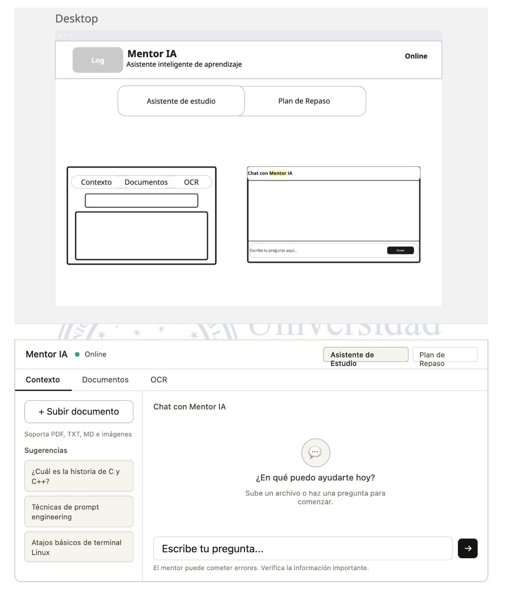
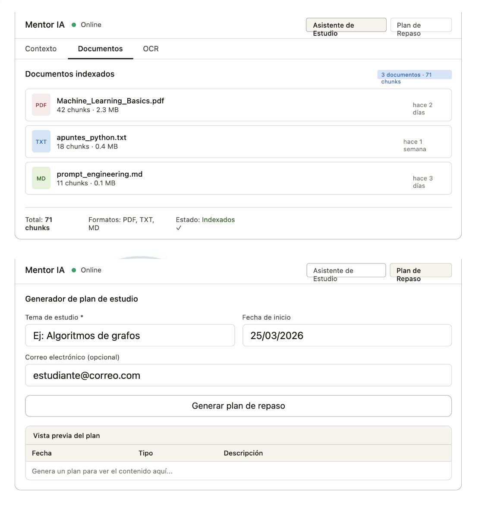
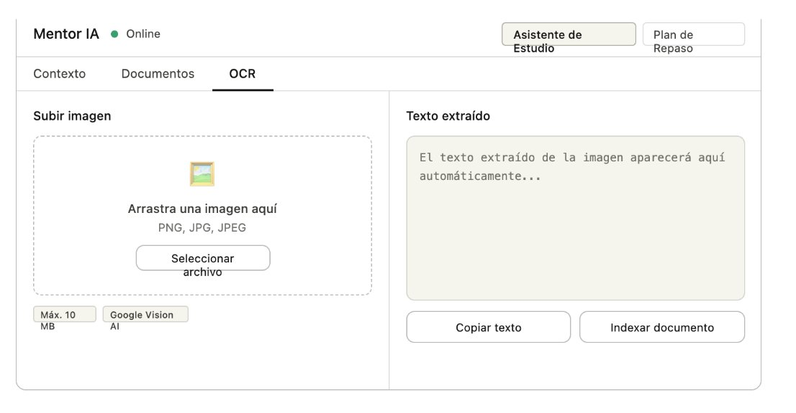

# Wireframes y diseño de interfaz — Mentor IA Frontend

> Documento de diseño del frontend Next.js del sistema **Mentor IA**.
> Describe el inventario actual del frontend desplegado, el sistema de
> layout, los wireframes pantalla por pantalla (con imágenes), el patrón
> de estados estandarizados y el diseño responsive.
>
> Versión: 2.1 · Fecha: 2026-05-17.

---

## Tabla de contenidos

1. [Inventario actual del frontend desplegado](#1-inventario-actual-del-frontend-desplegado)
2. [Stack confirmado](#2-stack-confirmado)
3. [Sistema base de layout](#3-sistema-base-de-layout)
4. [Wireframes pantalla por pantalla](#4-wireframes-pantalla-por-pantalla)
5. [Estados estandarizados](#5-estados-estandarizados)
6. [Diseño responsive](#6-diseño-responsive)
7. [Bug visual conocido](#7-bug-visual-conocido)
8. [Para defender en sustentación](#8-para-defender-en-sustentación)

> **Nota sobre los wireframes.** Las imágenes incluidas en este documento
> representan el frontend tal como está desplegado en
> [www.iamentor.tech](https://www.iamentor.tech/) a
> la fecha de esta entrega. Los datos visibles dentro de los wireframes
> (nombres de archivos, número de chunks, etc.) son **ilustrativos** y no
> corresponden a documentos reales indexados en el momento de captura.

---

## 1. Inventario actual del frontend desplegado

### 1.1 Páginas existentes (carpeta `app/`)

| Ruta            | Archivo                      | Estado                                                                          |
| --------------- | ---------------------------- | ------------------------------------------------------------------------------- |
| `/`             | `app/page.tsx`               | Activa: tabs `Asistente de Estudio` + `Plan de Repaso`.                         |
| `/docs`         | `app/docs/page.tsx`          | Legacy: gestor de documentos en estilo anterior.                                |
| `/ocr`          | `app/ocr/page.tsx`           | Legacy: usa `OCRUploader.tsx` antiguo.                                          |
| `app/layout.tsx`| Root layout                  | Inter font + `lang="es"`; sin metadata enriquecida ni ThemeProvider.            |

### 1.2 Componentes de dominio (carpeta `components/`)

| Componente              | Uso actual                                                |
| ----------------------- | --------------------------------------------------------- |
| `study-assistant.tsx`   | Vista principal: chat RAG + sidebar Contexto/Docs/OCR.    |
| `review-plan.tsx`       | Plan de repaso (configurador + timeline).                 |
| `AnswerCard.tsx`        | Card legacy con origen RAG.                               |
| `SourcesList.tsx`       | Lista de fuentes con score.                               |
| `QueryBox.tsx`          | Textarea de pregunta legacy.                              |
| `OCRUploader.tsx`       | Uploader legacy de `/ocr`.                                |
| `PlanSection.tsx`       | Versión legacy del plan.                                  |

### 1.3 Componentes shadcn/ui ya instalados (`components/ui/`)

`alert`, `badge`, `button`, `card`, `input`, `label`, `radio-group`,
`scroll-area`, `separator`, `skeleton`, `tabs`, `textarea`.

### 1.4 API integrada (`lib/api.ts`)

Funciones expuestas:

- `askQuery(pregunta)` → `POST /query`
- `createPlan(payload)` → `POST /plan-repaso`
- `ocrImage(file)` → `POST /ocr-imagen`
- `listDocs()` → `GET /list-docs`
- `uploadDocument(file)` → `POST /upload-document`
- `getIndexedDocuments()` → `GET /documentos-indexados`

URL del backend: `NEXT_PUBLIC_BACKEND_URL` (variable de entorno).

---

## 2. Stack confirmado

A la fecha de esta entrega, el `package.json` del frontend declara las
siguientes dependencias principales:

| Componente                  | Versión / Detalle                        |
| --------------------------- | ---------------------------------------- |
| Next.js                     | 16.2.4 (App Router)                      |
| React                       | 19.2.5                                   |
| TypeScript                  | ^5                                       |
| Tailwind CSS                | ^4 (vía `@tailwindcss/postcss`)          |
| Radix Primitives            | alert-dialog, label, radio-group, scroll-area, separator, slot, tabs |
| lucide-react                | ^0.554.0                                 |
| Utilidades de clases        | `class-variance-authority`, `clsx`, `tailwind-merge` |
| ESLint                      | ^9 con `eslint-config-next` 16.2.4       |

---

## 3. Sistema base de layout

### 3.1 Estructura general

El layout actual del frontend desplegado utiliza un patrón de **header
horizontal + tabs principales + sub-tabs verticales**:

- **Header:** branding "Mentor IA" + subtítulo + indicador `Online` +
  tabs principales (`Asistente de Estudio` / `Plan de Repaso`).
- **Tabs principales:** dos tabs raíz que cambian toda la vista.
- **Sub-tabs (dentro de "Asistente de Estudio"):** `Contexto`,
  `Documentos`, `OCR`.

### 3.2 Vista general (Desktop)



La parte superior muestra la **maqueta de baja fidelidad** del layout
general: header con logo, subtítulo "Asistente inteligente de
aprendizaje", indicador `Online` a la derecha, y debajo los dos tabs
principales con el contenido dividido en dos columnas (sub-navegación a
la izquierda, chat a la derecha).

La parte inferior muestra la **versión renderizada** con los componentes
shadcn aplicados.

---

## 4. Wireframes pantalla por pantalla

### 4.1 Asistente de Estudio · Tab `Contexto`


**Elementos principales:**

- **Columna izquierda (sub-navegación + acciones rápidas):**
  - Botón primario `+ Subir documento`.
  - Texto descriptivo: *"Soporta PDF, TXT, MD e imágenes"*.
  - Sección `Sugerencias` con tres consultas hardcoded:
    - *"¿Cuál es la historia de C y C++?"*
    - *"Técnicas de prompt engineering"*
    - *"Atajos básicos de terminal Linux"*

- **Columna derecha (chat):**
  - Header "Chat con Mentor IA".
  - Estado vacío: icono central + *"¿En qué puedo ayudarte hoy?"* +
    *"Sube un archivo o haz una pregunta para comenzar"*.
  - Composer inferior con placeholder *"Escribe tu pregunta..."* y
    botón de envío (flecha).
  - Aviso legal al pie: *"El mentor puede cometer errores. Verifica la
    información importante"*.

**Comportamiento:** al enviar una pregunta, la respuesta del backend
aparece como una burbuja de chat con cabecera de fuentes
(`archivo · chunk · score`) cuando el origen es RAG, o sin fuentes
cuando es modelo.

### 4.2 Asistente de Estudio · Tab `Documentos`



**Elementos principales (parte superior de la imagen):**

- Header del tab con título *"Documentos indexados"* y badge en azul
  con el total (`3 documentos · 71 chunks` en el ejemplo, datos
  ilustrativos).
- Lista de tarjetas, una por documento, mostrando:
  - Icono por tipo (PDF, TXT, MD).
  - Nombre del archivo.
  - Conteo de chunks y tamaño en MB.
  - Fecha relativa de la última indexación (*"hace 2 días"*).
- Footer de resumen con totales y formatos detectados.
- Estado *"Indexados ✓"* en verde.

**Origen de los datos:** la lista se consume desde el endpoint
`GET /documentos-indexados`, que hace `scroll` en Qdrant agrupando por
`source_path`.

### 4.3 Plan de Repaso · Modo `Tema`

La parte inferior de la imagen anterior muestra el tab **Plan de
Repaso** en modo `Tema`:

**Elementos principales:**

- Campo obligatorio *"Tema de estudio"* con placeholder *"Ej:
  Algoritmos de grafos"*.
- Campo *"Fecha de inicio"* con datepicker (valor de ejemplo:
  *25/03/2026*).
- Campo opcional *"Correo electrónico"* con placeholder.
- Botón primario *"Generar plan de repaso"* ocupando todo el ancho.
- Sección *"Vista previa del plan"* con tabla de tres columnas
  (`Fecha`, `Tipo`, `Descripción`) que se llena tras la generación.

**Comportamiento:**

- Al generar, se hacen cuatro llamadas a OpenAI `gpt-4o-mini` (una por sesión: D+1,
  D+7, D+14, D+30).
- Si hay email, se envía el plan por Make.com en HTML.
- Sin email, el plan solo aparece en la timeline en pantalla.

### 4.4 Asistente de Estudio · Tab `OCR`



**Elementos principales:**

- **Columna izquierda (subir imagen):**
  - Dropzone con borde discontinuo: *"Arrastra una imagen aquí"* /
    *"PNG, JPG, JPEG"*.
  - Botón secundario *"Seleccionar archivo"*.
  - Badges informativos: *"Máx. 10 MB"* y *"OpenAI Vision AI"*.

- **Columna derecha (resultado):**
  - Textarea de solo lectura con el texto extraído.
  - Botón *"Copiar texto"* (al portapapeles).
  - Botón *"Indexar documento"* (ver nota más abajo).

> **Nota sobre el botón "Indexar documento".** Este botón aparece en el
> wireframe como propuesta para permitir que el texto extraído por OCR
> se inserte automáticamente en la base vectorial RAG (equivale a tomar
> el texto y subirlo como `.txt` al endpoint `/upload-document`). Su
> implementación efectiva en el frontend desplegado debe verificarse
> antes de la sustentación. Si no está implementado, queda documentado
> aquí como mejora propuesta de UX.

---

## 5. Estados estandarizados

El frontend usa un patrón consistente de estados para todas las
pantallas, basado en componentes shadcn/ui:

| Estado    | Componente shadcn               | Patrón visual                                                                 |
| --------- | ------------------------------- | ----------------------------------------------------------------------------- |
| Carga     | `Skeleton`                      | Skeletons del tamaño de las filas/tarjetas reales.                            |
| Vacío     | `Card` + ícono + CTA            | Ícono `lucide-react` 48px, título neutro, subtítulo, botón primario opcional. |
| Error     | `Alert variant="destructive"`   | `AlertCircle` + título + descripción.                                         |
| Éxito     | Texto inline o badge verde      | Mensaje breve, ícono `CheckCircle2`.                                          |

**Limitación reconocida:** el patrón de toasts unificados no está
implementado. Los mensajes de éxito y error se muestran como `Alert`
inline o como mensajes de chat. Una mejora propuesta es integrar
`sonner` o `radix-toast` para toasts globales (ver
[`Flujo_Interaccion_Usuario_Sistema.md`](./Flujo_Interaccion_Usuario_Sistema.md),
sección 6).

---

## 6. Diseño responsive

### 6.1 Breakpoints utilizados (Tailwind 4 por defecto)

| Breakpoint | Ancho   | Comportamiento                                                   |
| ---------- | ------- | ---------------------------------------------------------------- |
| Base       | <640px  | Stack vertical, sub-tabs apiladas, composer full-width.          |
| `sm`       | ≥640px  | Las tarjetas de Documentos pasan a 2 columnas.                    |
| `md`       | ≥768px  | El layout de Asistente cambia a dos columnas (sidebar + chat).    |
| `lg`       | ≥1024px | Layout completo en grid (sidebar 4 col + chat 8 col).             |

### 6.2 Reglas por pantalla

- **Asistente · Contexto:** sidebar de sugerencias arriba en mobile,
  lateral en `md+`.
- **Asistente · Documentos:** tarjetas apiladas en mobile, grid de 2
  columnas en `md+`.
- **Asistente · OCR:** stack vertical en mobile (dropzone arriba,
  resultado abajo), split 50/50 en `md+`.
- **Plan de Repaso:** formulario en una columna en mobile, mantiene una
  columna también en desktop por simplicidad de lectura.

### 6.3 Consideraciones globales

- **Composer del chat:** fijo en la parte inferior con
  `pb-[env(safe-area-inset-bottom)]` para iOS.
- **Tipografía:** Inter (cargada desde `app/layout.tsx`).
- **Modo oscuro:** los tokens `.dark` están definidos en `globals.css`
  pero **no hay toggle** implementado en la UI. Es una mejora propuesta.

---

## 7. Bug visual conocido

En el componente
[`study-assistant.tsx`](../../frontend/components/study-assistant.tsx)
se imprime accidentalmente el texto `score: ... pregunta` en la cabecera
de fuentes de cada respuesta. Esto se debe a una concatenación
incorrecta entre `msg.response?.fuentes[i].score` y
`msg.response?.pregunta` sin separador apropiado.

**Impacto:** estético. La respuesta funciona correctamente; solo el
formato del label de la fuente queda mal renderizado.

**Corrección sugerida:** separar las dos expresiones con un salto de
línea o coma:

```tsx
// Actual (con bug)
<span>{`score: ${score} ${pregunta}`}</span>

// Corregido
<span>{`score: ${score.toFixed(2)}`}</span>
```

Este bug se mantiene documentado por transparencia, aunque su
corrección es trivial y se hará antes de la sustentación.

---

## 8. Para defender en sustentación

Cuatro puntos clave sobre el diseño del frontend:

1. **El frontend desplegado coincide con los wireframes presentados.**
   Las tres imágenes incluidas en este documento corresponden al
   estado real de
   [www.iamentor.tech](https://www.iamentor.tech/).
   No hay pantallas "hipotéticas" sin implementación. Al abrir el
   frontend se encuentran las tres sub-pestañas, el indicador
   "Online" (con polling real a `/health`), las sugerencias hardcoded,
   el dropzone de OCR y el formulario del plan, en ese orden.

2. **El stack frontend está alineado con los requisitos.** Next.js
   16.2.6 + React 19 + TypeScript 5 + Tailwind 4 + shadcn/ui, según el
   documento de requerimientos. La versión exacta se verifica en
   `package.json`.

3. **El diseño es responsive con cuatro breakpoints.** Mobile-first
   con stack vertical en pantallas pequeñas, dos columnas a partir de
   `md` (768px), y grid completo en `lg` (1024px). Esto cumple el
   requisito no funcional de UI responsive.

4. **Las mejoras y bugs identificados están documentados con
   transparencia.** El bug visual del `score: ... pregunta`, la
   ausencia de toggle de modo oscuro, la falta de toasts unificados y
   la posible no-implementación del botón "Indexar documento" en OCR
   están reconocidos. Documentar las limitaciones forma parte del
   criterio de ingeniería.

---

_Última actualización: 2026-05-11._
